# How to Create a Curated Calendar in B1.church Admin

  <ul id="playlist">
      <li class="active"><a href="/videos/b1Admin/curated-calendar/output.mp4" data-steps="curated-calendar-steps">Creating a Curated Calendar</a></li>
  </ul>

<h3>Steps</h3>

  
1.From the B1.church Dashboard click on B1.Church▼

  
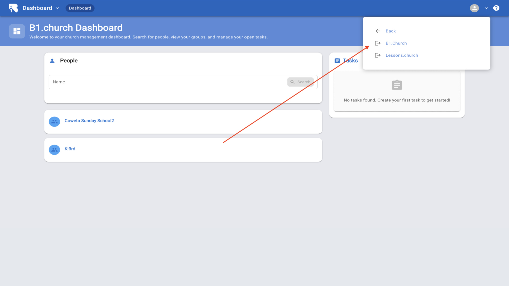

  
2.Click your name then Click the Admin Portal▼

  
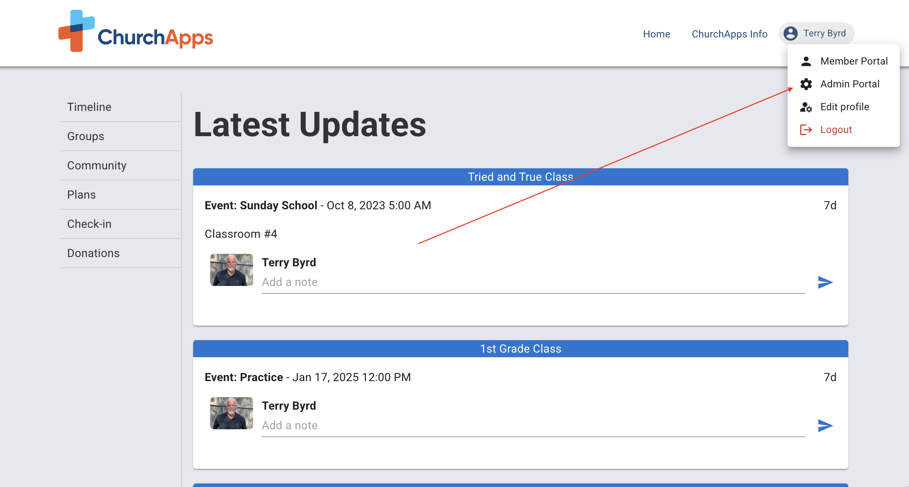

  
3.From the dashboard navigate to the Website section▼

  
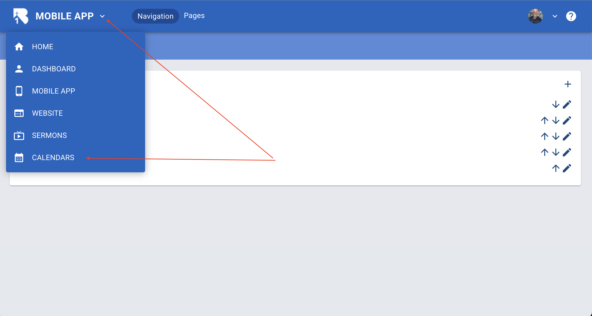

  
4.Click on Calendars from the top navigation▼

  
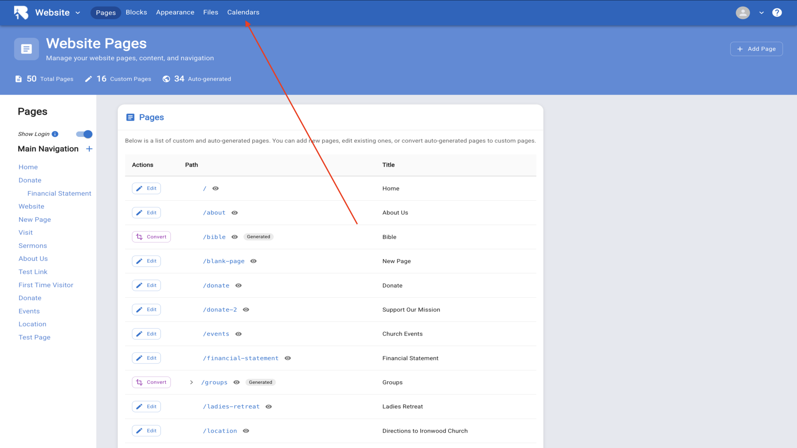

  
5.Click Add Calendar to create a new curated calendar▼

  
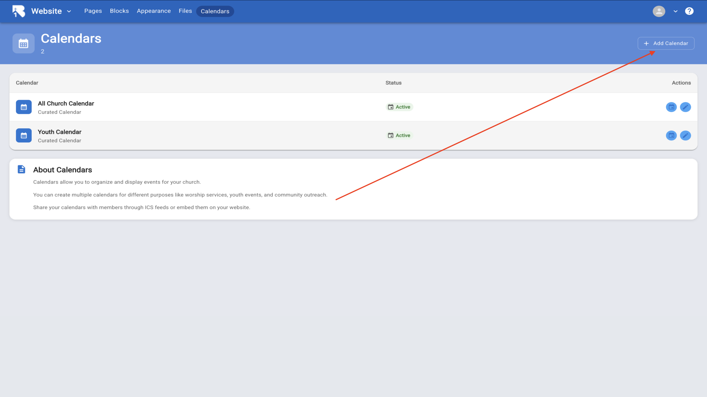

  
6.Give your calendar a name and click Create▼

  
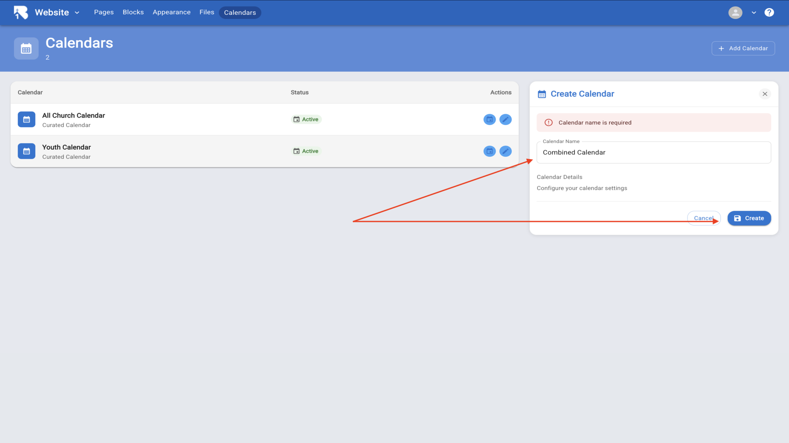

  
7.Click on the manage events icon to configure your new calendar▼

  
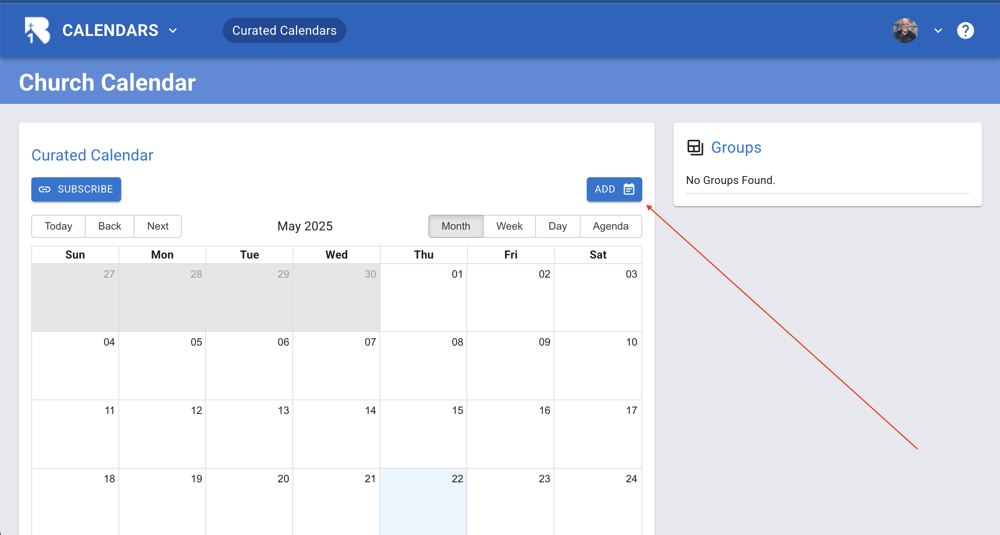

  
8.Click Add in the Groups in Calendar section to add groups▼

  
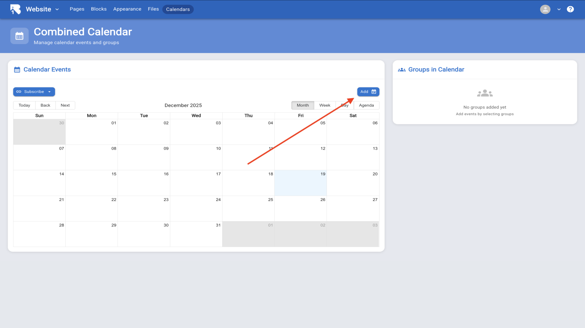

  
9.Select a group from the dropdown menu▼

  
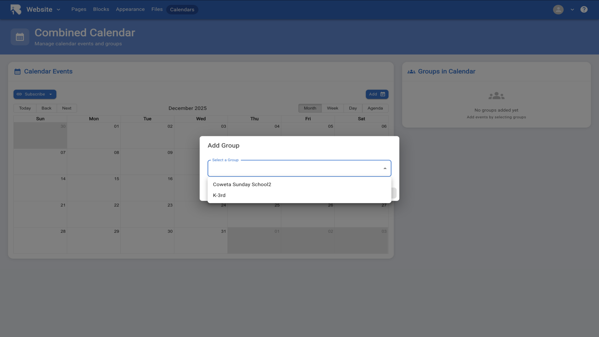

  
10.Choose whether to add all events or specific events then click Save▼

  
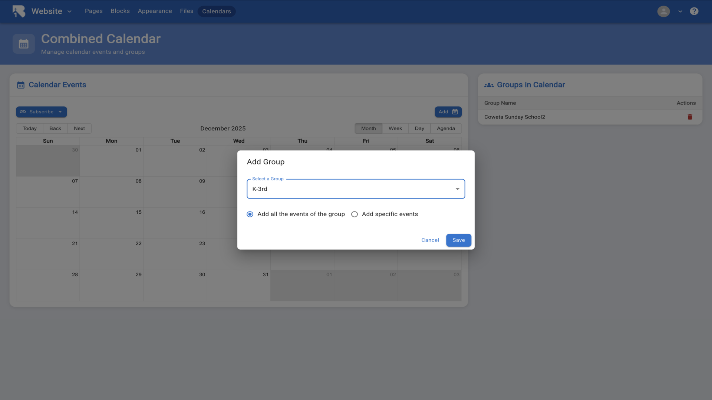

  
11.Add as many groups as you want to include in your curated calendar▼

  
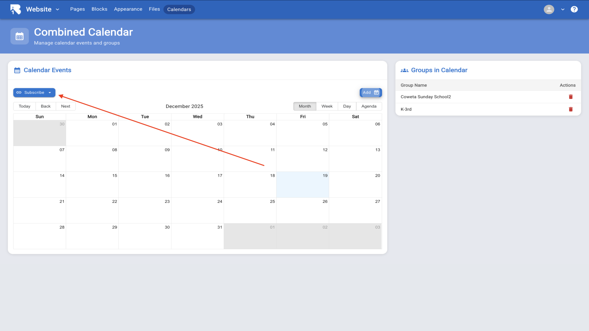

  
12.Click Subscribe to copy the ICS link or download the file to share your calendar. Your calendar can now be embedded on your website and mobile app▼

  
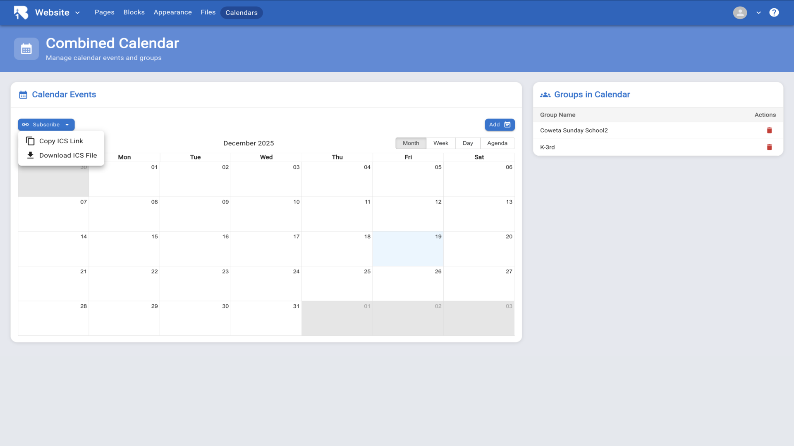

## Related Tutorials

- <a href="/b1Admin/groups.html">Groups</a>
- <a href="/b1Admin/group-calendar.html">Group Calendar</a>
