# Exporting Data from B1.church Admin

  <ul id="playlist">
    <li class="active">
      <a href="/videos/b1Admin/export-data/output.mp4" data-steps="export-data-steps">How to Export Data from B1.church Admin</a>
    </li>
  </ul>

<h3>Steps</h3>

  
1.Click on the Settings icon in the B1.church Admin dashboard▼

  
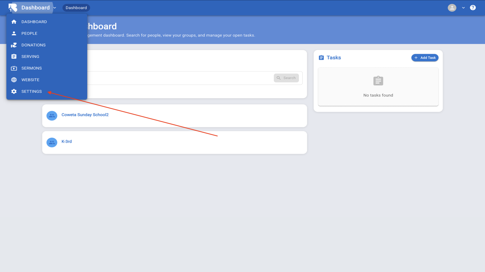

  
2.Click on the Import/Export button to access the import and export tool▼

  
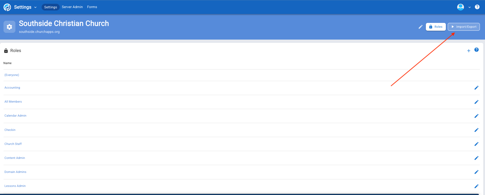

  
3.Click on the Data Source dropdown in Step 1 - Import Source▼

  
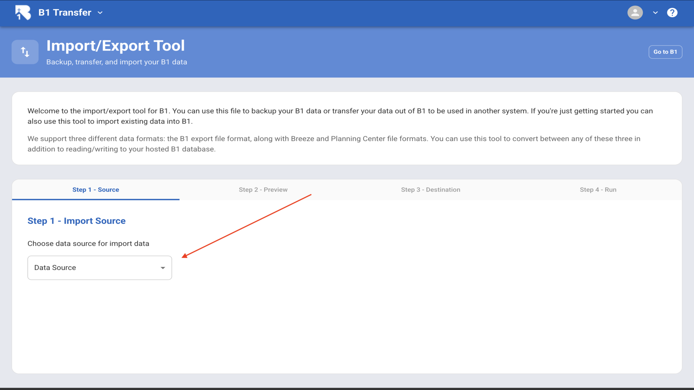

  
4.Select "B1 Database" from the dropdown menu to export your B1 church data▼

  
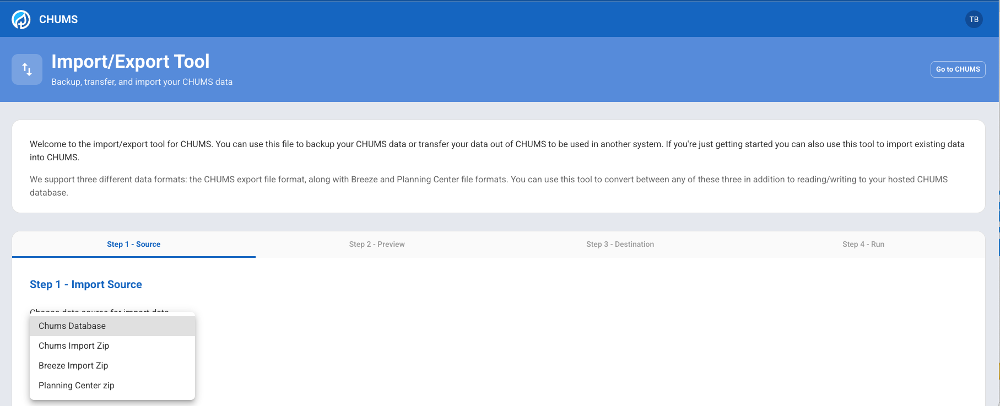

  
5.Review the preview of data to be exported and click "Continue to Destination"▼

  
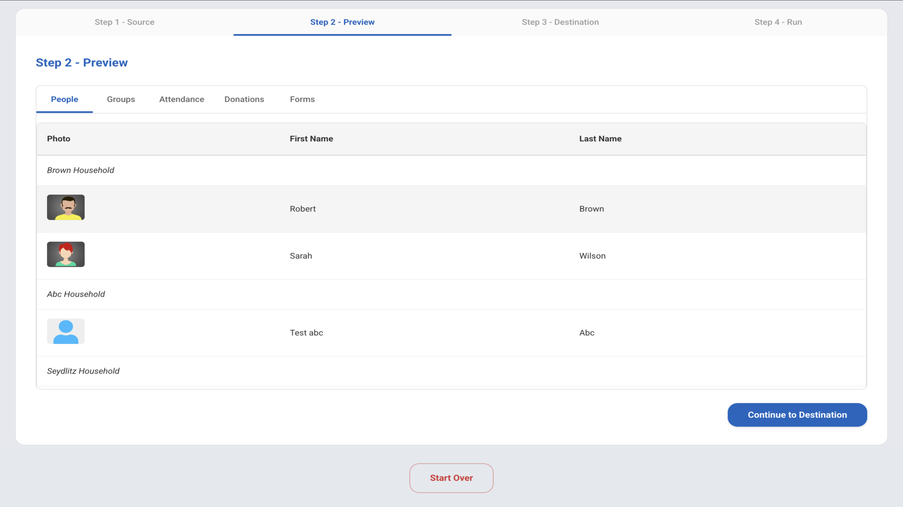

  
6.Click on the Export Destination dropdown in Step 3▼

  
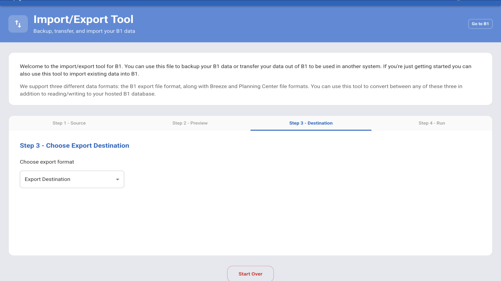

  
7.Select "B1 Export Zip" to create a zip file containing all your exported data▼

  
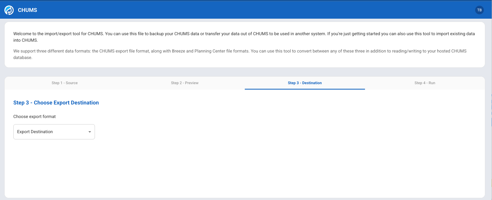

  
8.Monitor the export progress with green check marks. Wait for the process to finish▼

  
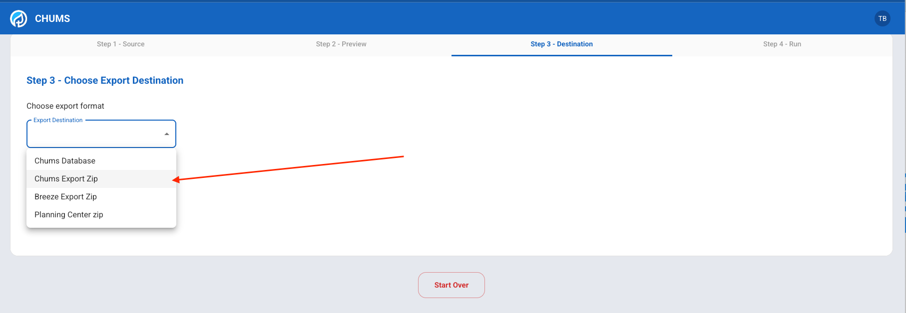

  
9.View the downloaded B1Export file in the Recent Download History▼

  
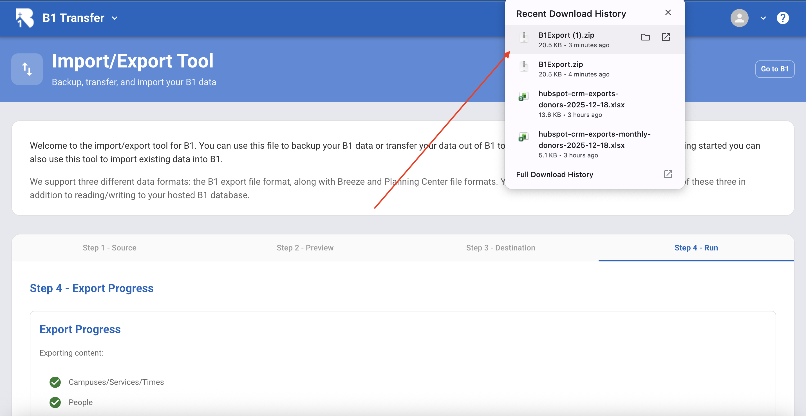

  
10.Locate and unzip the B1Export file in your downloads folder▼

  
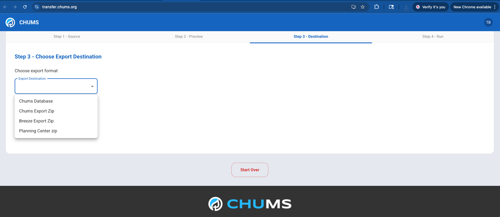

  
11.Open CSV files like people.csv with Excel or Numbers to view your exported data▼

  
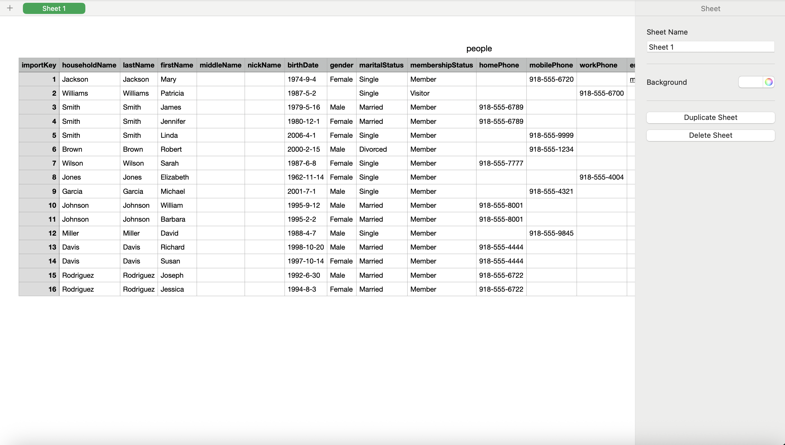

