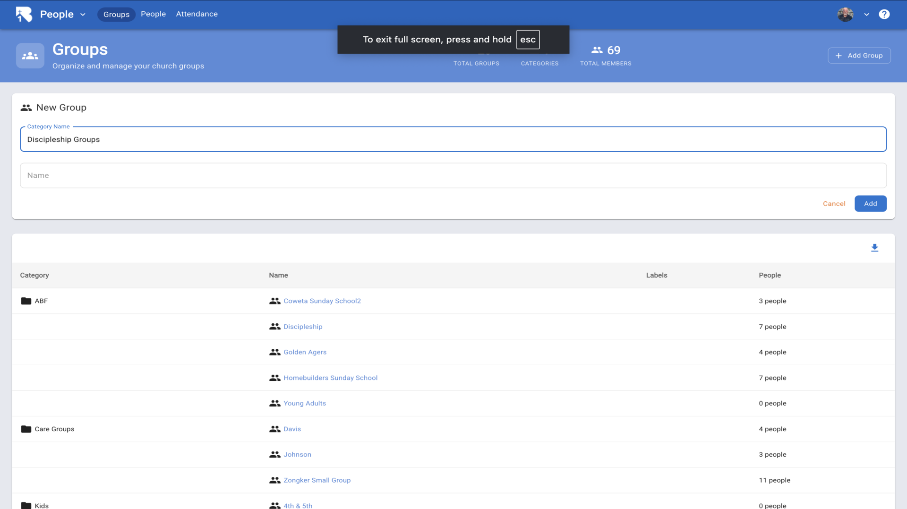
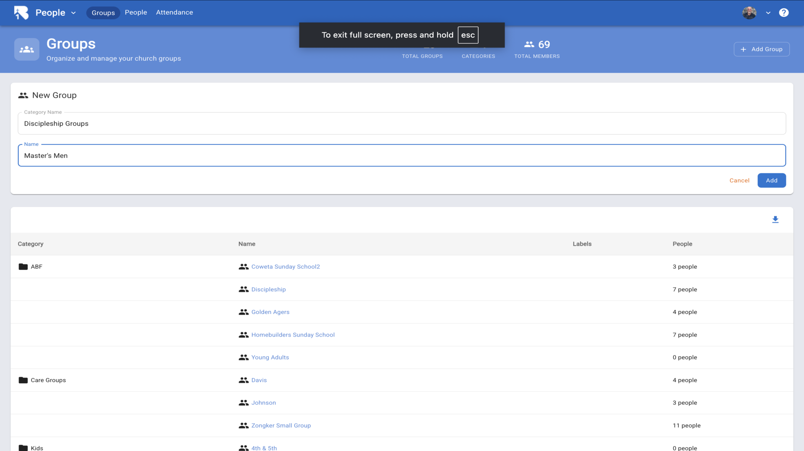
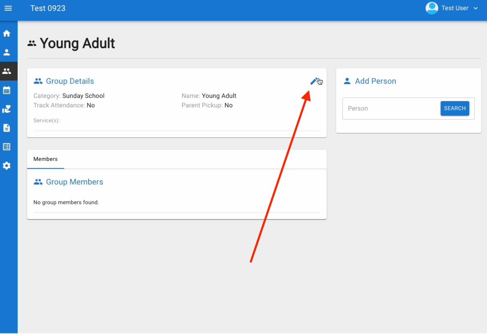
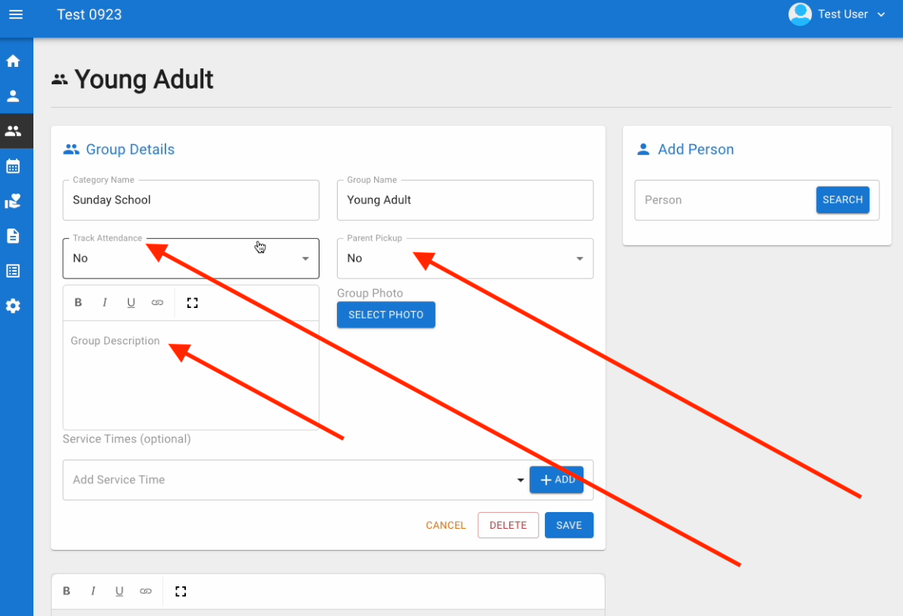
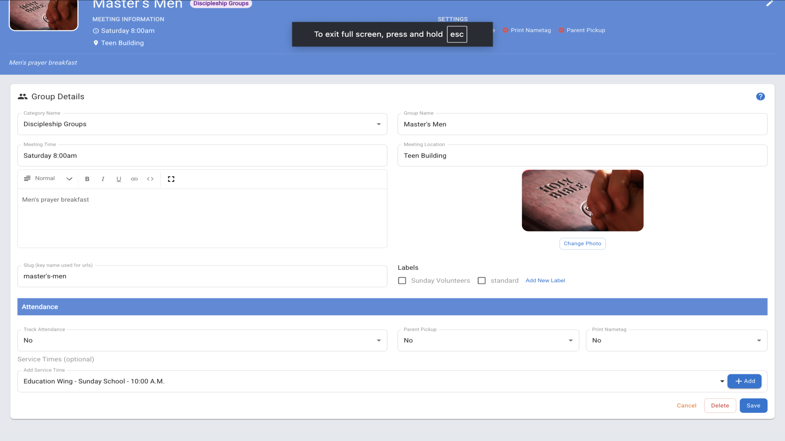
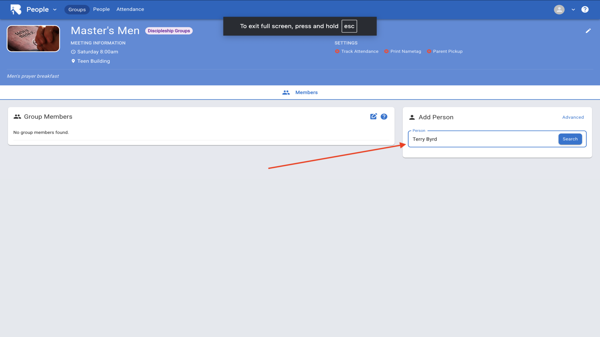
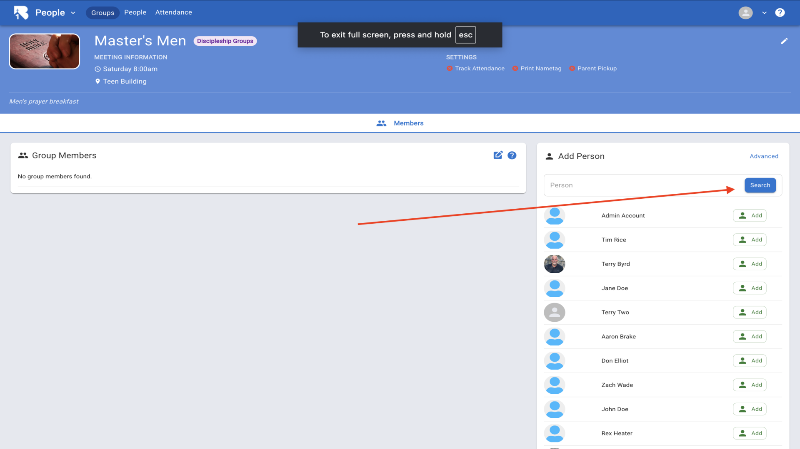
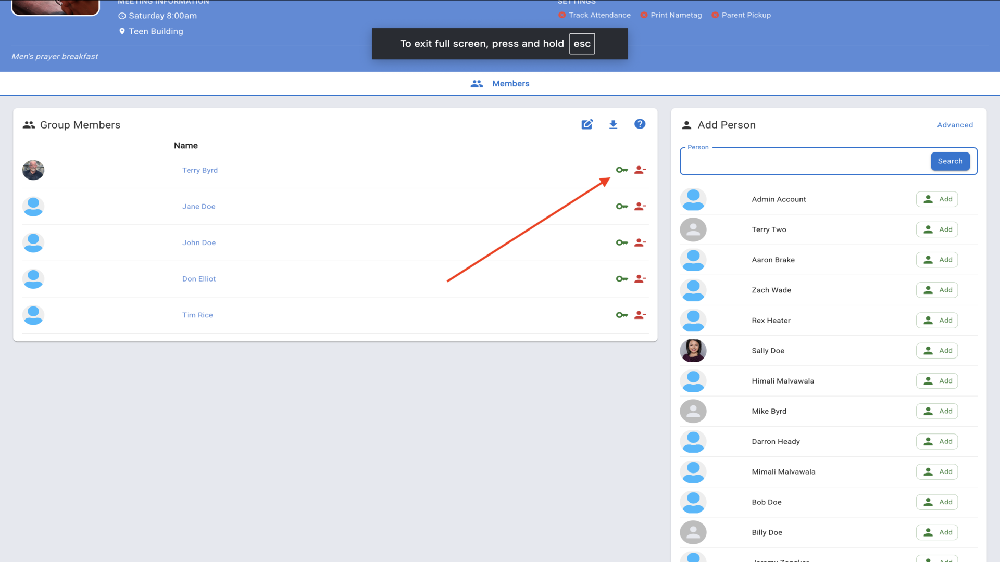
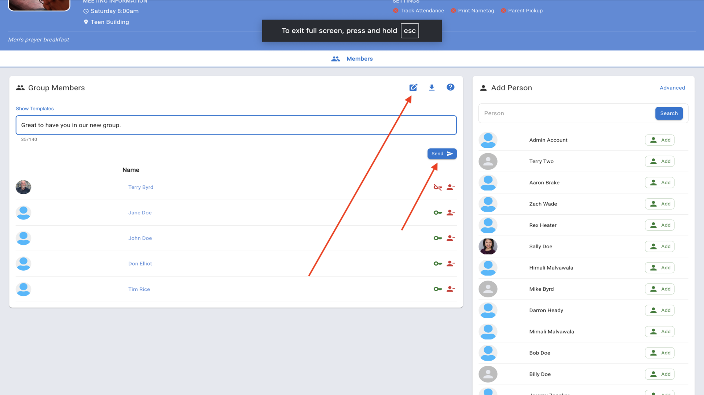
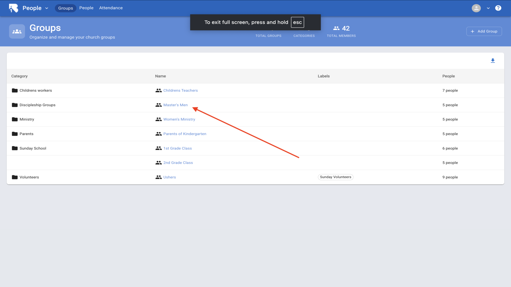

# How to Set Up Groups in B1.church Admin

  <ul id="playlist">
      <li class="active"><a href="/videos/b1Admin/groups/output.mp4" data-steps="groups-steps">Setting Up Groups</a></li>
  </ul>

<h3>Steps</h3>

  
1.Navigate to the B1 dashboard▼

  

  
2.Click on the Groups tab▼

  

  
3.Click Add Group and enter a Category Name▼

  

  
4.Enter the Group Name▼

  

  
5.Click Add. Your new group will appear in the list▼

  

  
6.Click on the group name, then click the pencil icon▼

  

  
7.Configure the group settings including attendance tracking, meeting times, group description, and service times. Click Save▼

  

  
8.Click the Members tab and search for a person or scroll through your database▼

  

  
9.Click the Add button next to the person's name▼

  

  
10.Your group members are now listed. Use the green key icon to designate group leaders▼

  

  
11.Send messages to all group members. Type your message and click Send▼

  

  
12.To export your group data, click the download icon▼

  

  
13.All your church groups are organized by categories▼

  

## Related Tutorials

- <a href="/b1Admin/group-roster.html">Group Roster</a>
- <a href="/b1Admin/group-calendar.html">Group Calendar</a>
