# Importing Data from Breeze Church Management into B1.church Admin

  <ul id="playlist">
    <li class="active">
      <a href="/videos/b1Admin/import-breeze/output.mp4" data-steps="import-breeze-steps">How to Import Data from Breeze into B1.church Admin</a>
    </li>
  </ul>

<h3>Steps</h3>

  
1.Log into Breeze and click the settings gear icon▼

  
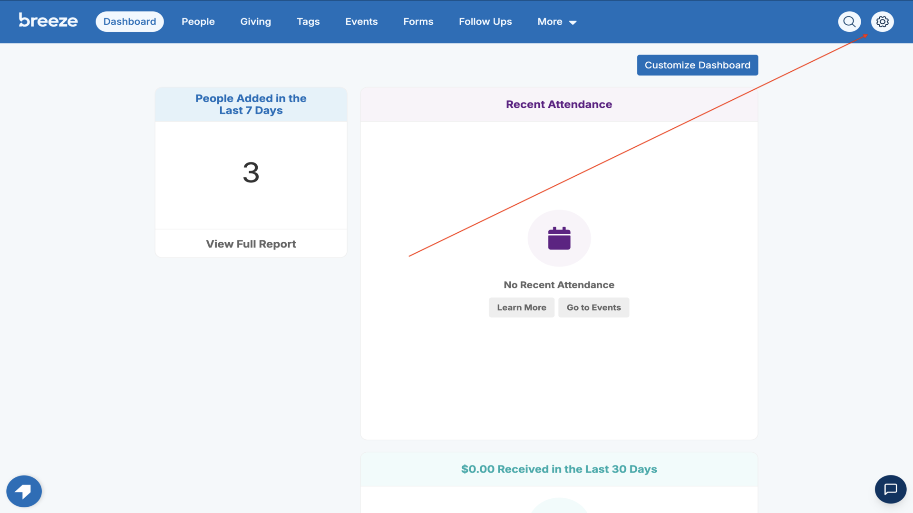

  
2.Select settings to manage your organization▼

  
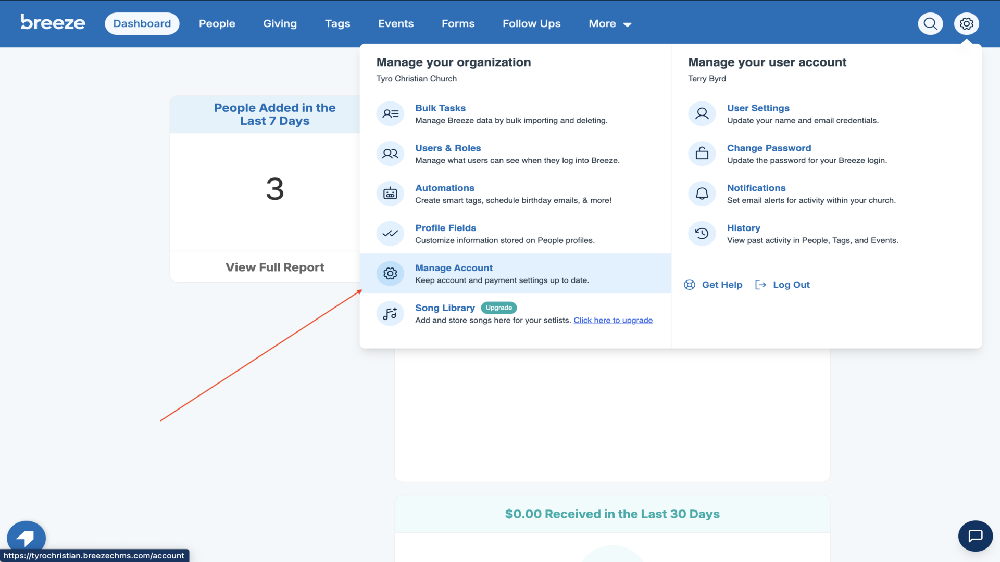

  
3.Click Export in the left sidebar▼

  
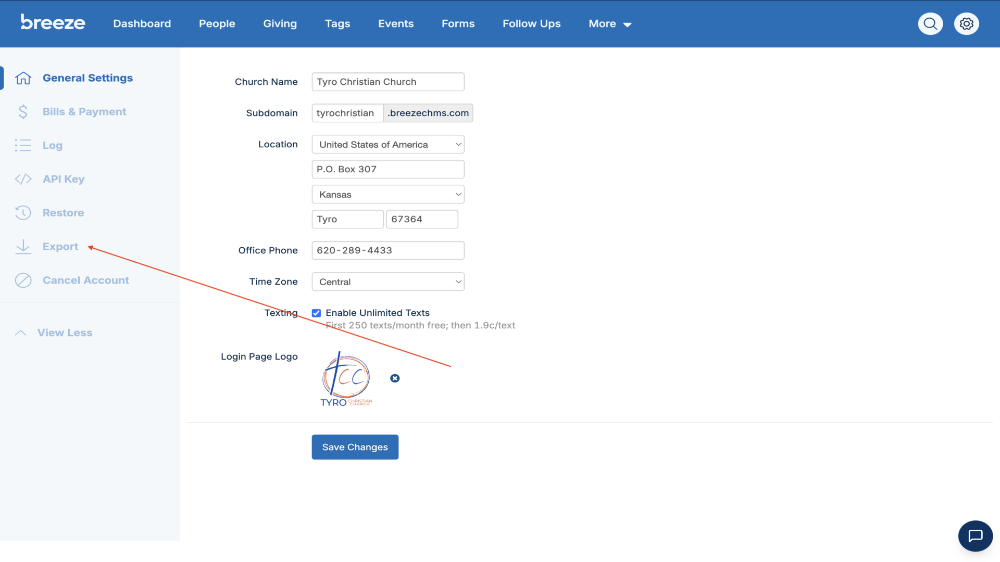

  
4.Select People and click Export▼

  
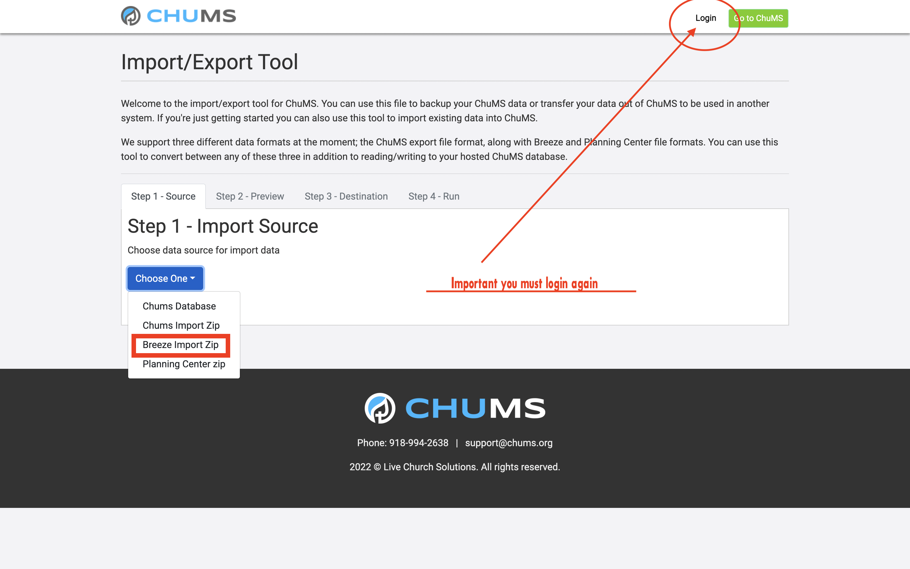

  
5.Select Tags and click Export▼

  

  
6.Select Contributions and click Export▼

  
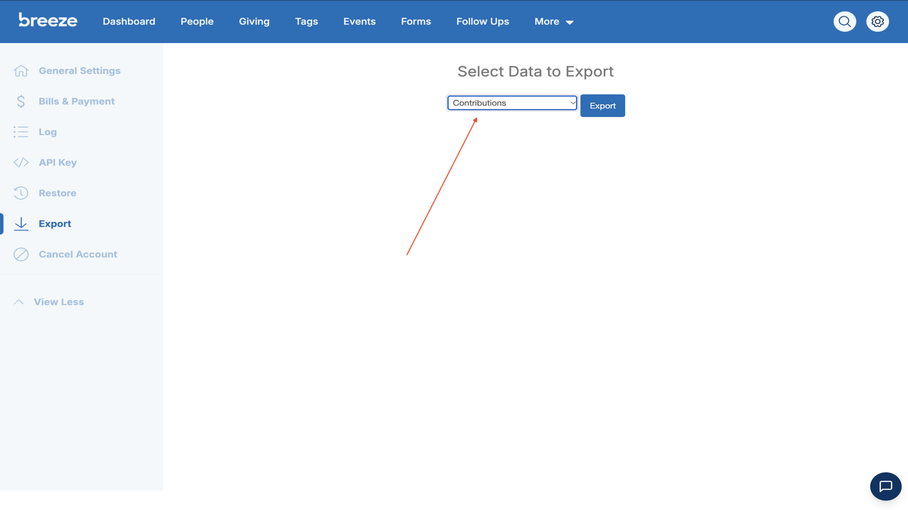

  
7.Locate and select all three exported files on your desktop▼

  
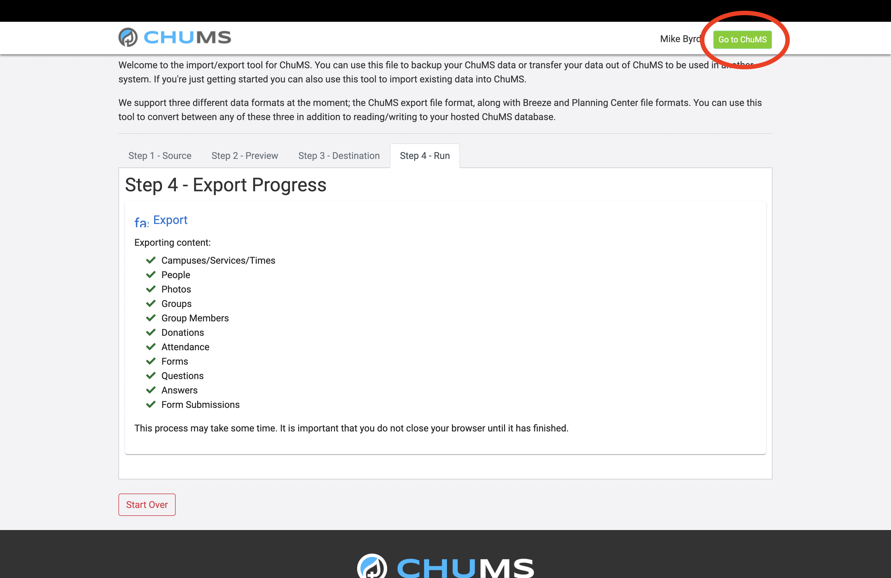

  
8.Right-click and compress the files into a zip▼

  

  
9.Log into B1.church Admin and click Settings▼

  
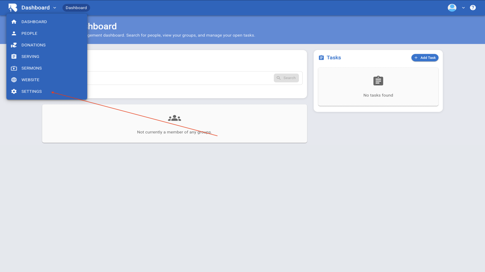

  
10.Click Import/Export button▼

  
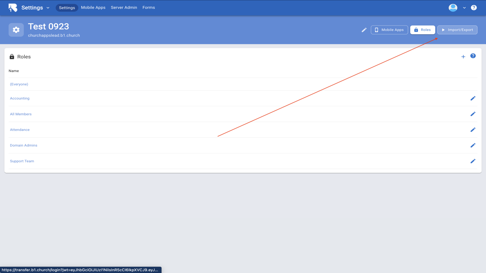

  
11.Click Choose One dropdown under Step 1 - Import Source▼

  
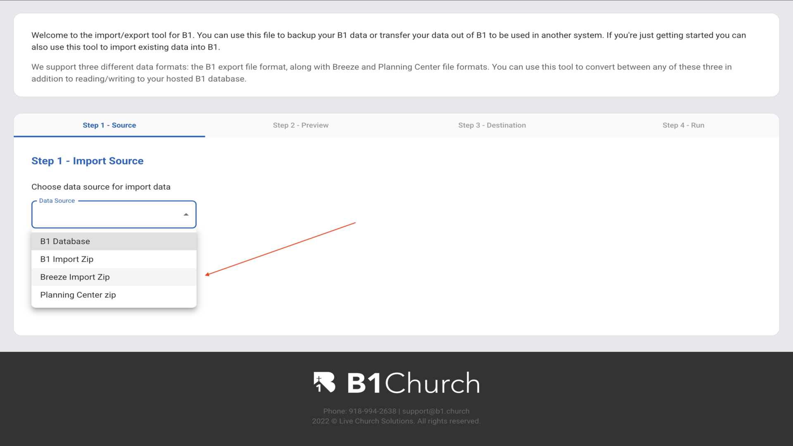

  
12.Select Breeze Import Zip from the dropdown▼

  
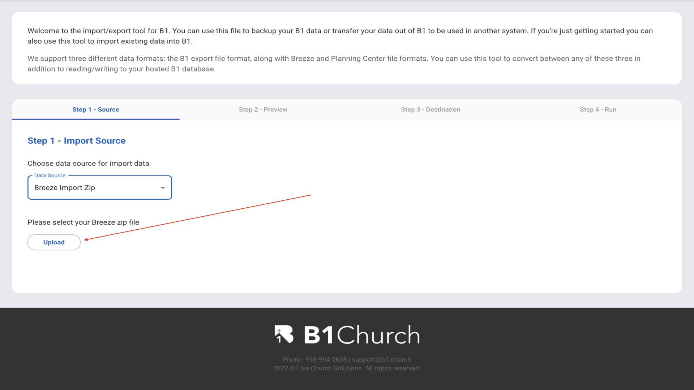

  
13.Upload the zip file you created▼

  
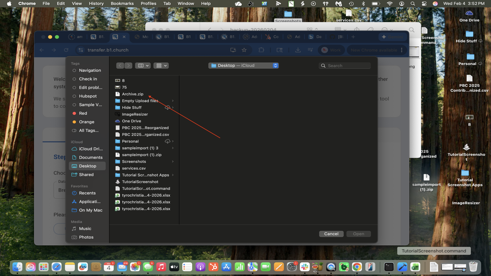

  
14.Review the data preview and click Continue▼

  

  
15.Select B1 Database as the export destination▼

  

  
16.Review the import summary and proceed to Step 4▼

  
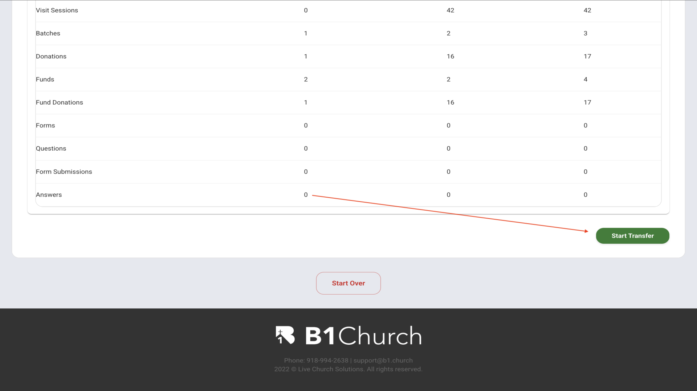

  
17.Watch the export progress with checkmarks for all items▼

  

  
18.Click Go to B1 to return to your dashboard▼

  
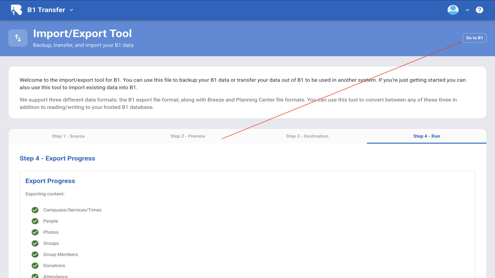

## Key Features

- **Direct Import**: B1 has a dedicated "Breeze Import Zip" option that automatically converts Breeze data
- **Three Required Files**: Export People, Tags, and Contributions from Breeze
- **Complete Data Transfer**: Imports people, photos, groups, donations, attendance, forms, and more

## Related Tutorials

- <a href="/b1Admin/import-csv.html">Import from CSV</a>

## Additional Resources

- [Breeze Export Documentation](https://support.breezechms.com/hc/en-us/articles/360001160713-Exporting-People)
- [Tithely Export Guide](https://support.tithe.ly/hc/en-us/articles/32166404593175-Exporting-Your-People-Data)
