# Welcome to B1.church Admin!

Thank you for choosing B1.church! We're excited to help you manage your church more effectively. This introduction video will walk you through the basics of getting started with the B1.church Admin platform.

For further support, please email [support@churchapps.org](mailto:support@churchapps.org).

  <ul id="playlist">
      <li class="active"><a href="/videos/b1Admin/intro/output.mp4" data-steps="intro-steps">Introduction to B1.church</a></li>
  </ul>

<h3>Steps</h3>

  
1.Using Google Chrome, log in to B1.church.▼

  

  
2.Click sign in and enter your username and password.▼

  
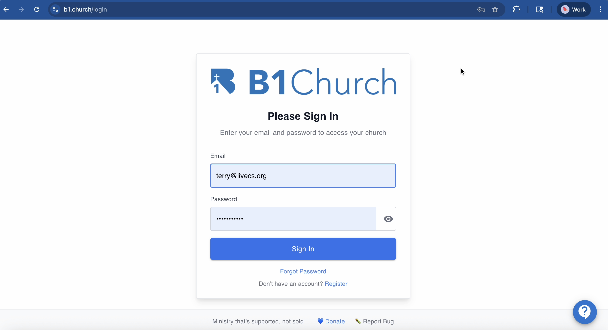

  
3.This will take you to the B1.church Admin dashboard. From here, you can manage your church's database, website, mobile app, lessons, and more.▼

  
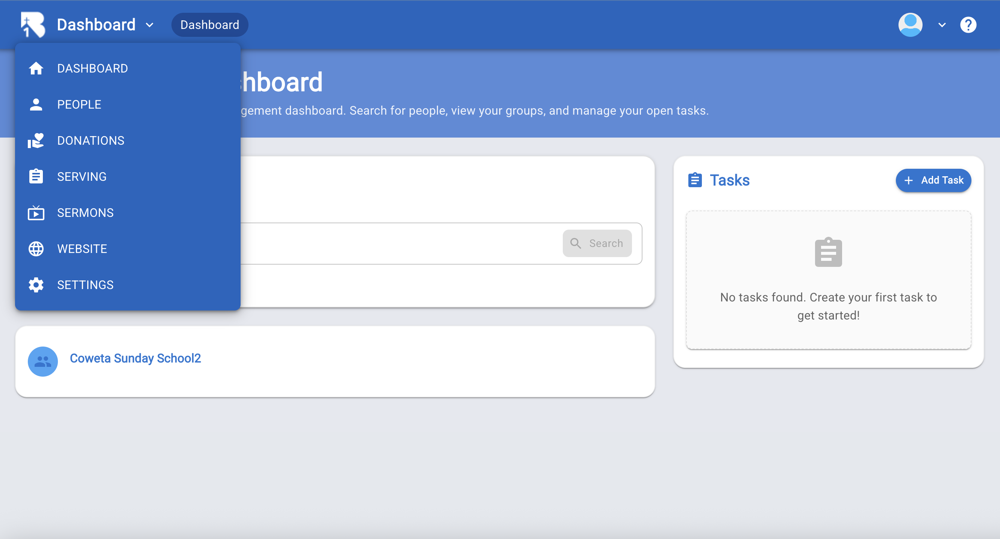

  
4.Click on Settings to set up your church's information, administrative roles, and other details.▼

  
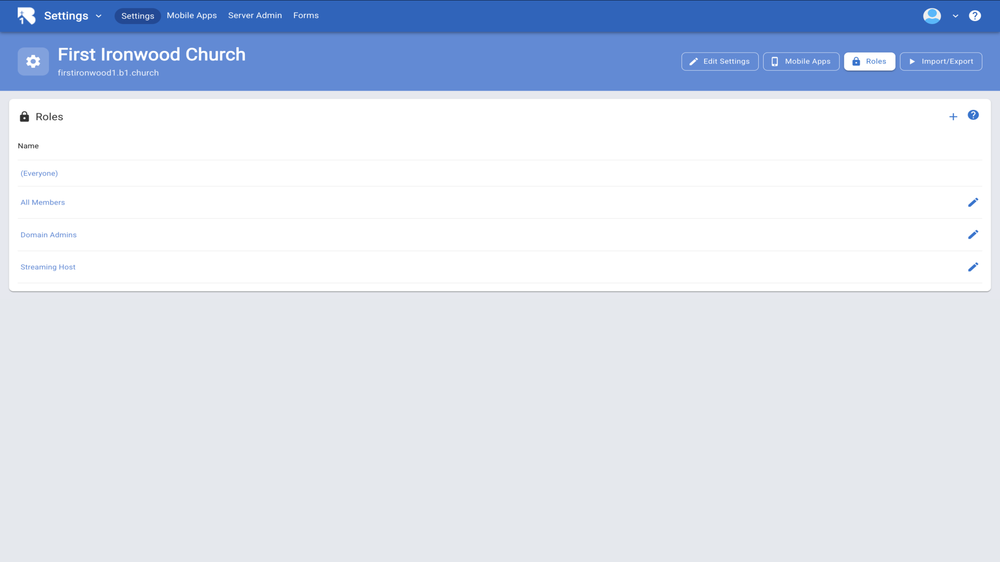

  
5.Click on the edit pencil to set up your church information.▼

  
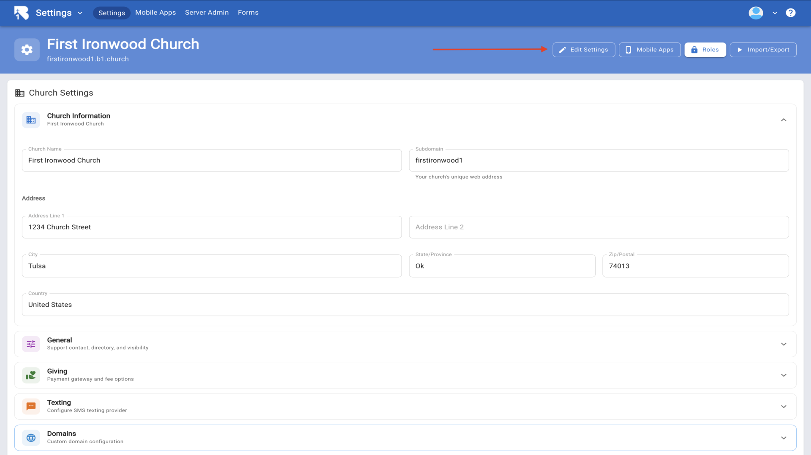

  
6.Back on the dashboard, click the question mark icon in the top right corner for help and tutorials.▼

  
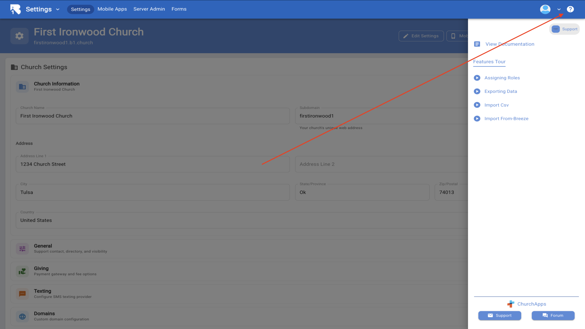

  
7.Click View Documentation.▼

  
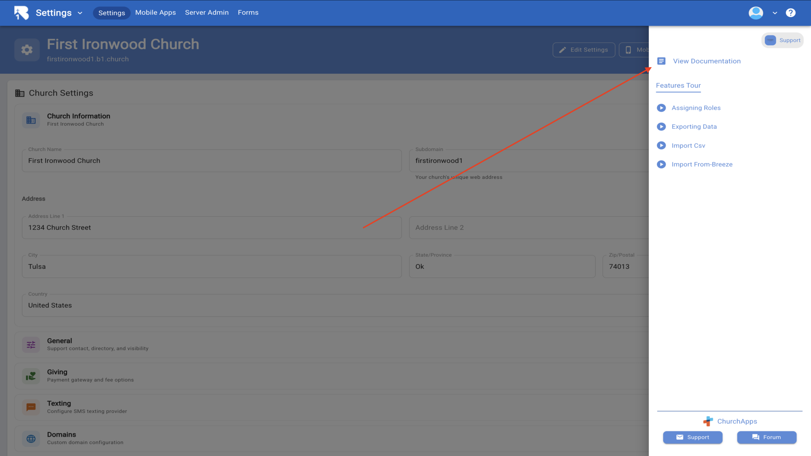

  
8.You will see a list of tutorials to help you get started with B1.church.▼

  
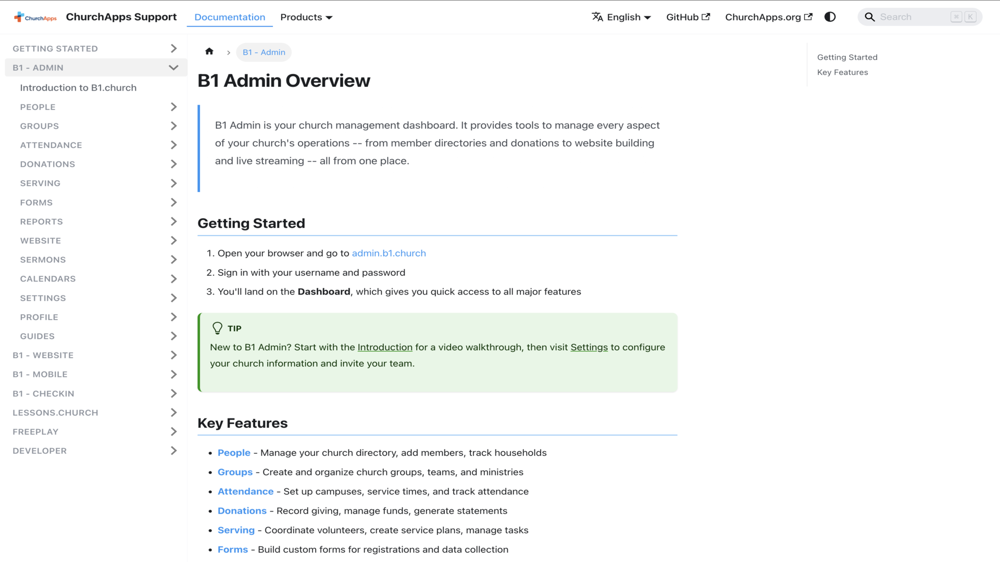

  
9.Navigate back to the dashboard and click the arrow next to your profile picture and choose Switch App.▼

  
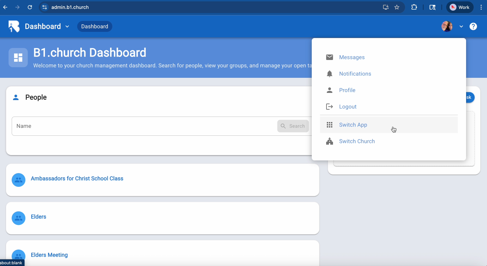

  
10.Choose Lessons.church.▼

  
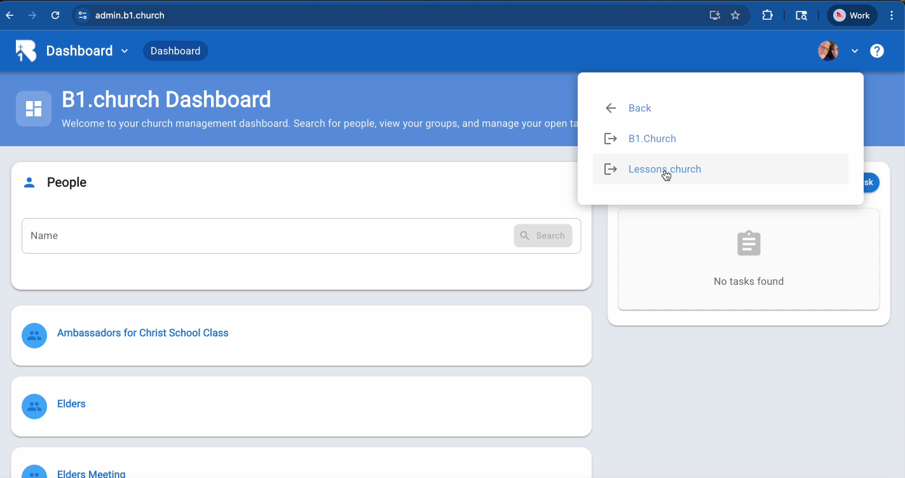

  
11.This will take you to Lessons.church, where you can manage your church's online lessons and curriculum.▼

  
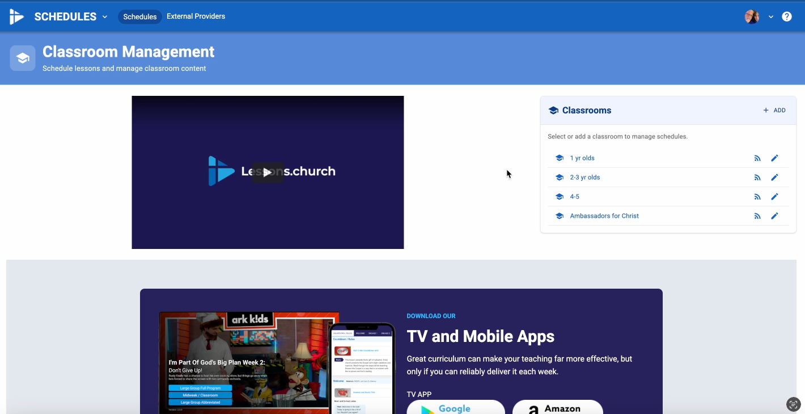

  
12.Switch back to B1.church by clicking the arrow next to your profile picture and choosing Switch App again.▼

  
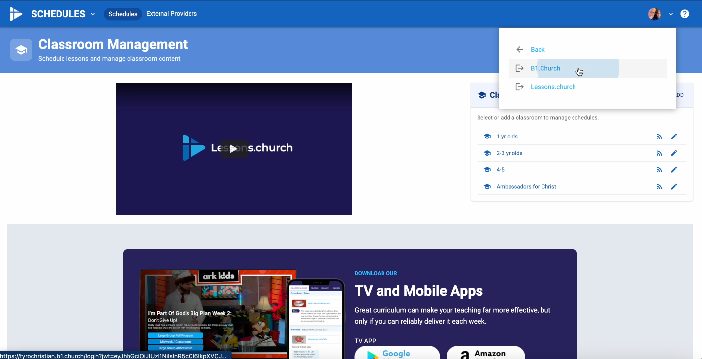

  
13.You can now enter B1.church through the member portal or the admin portal. The member portal allows you to see how B1.church looks to your members, view your groups, and manage your personal donations.▼

  
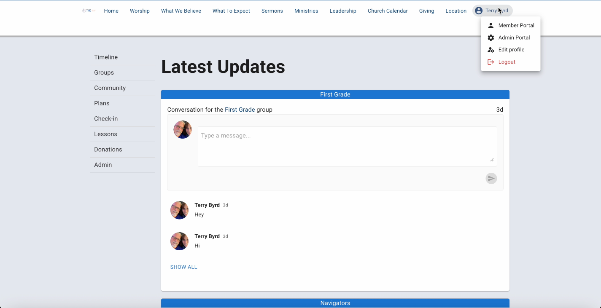

  
14.This video is just a brief introduction to B1.church. Be sure to watch our tutorials to help you get the most out of these programs.▼

  
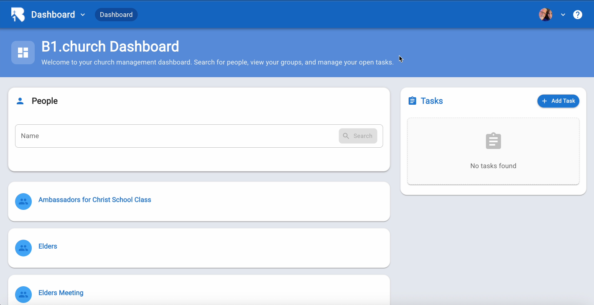

## Next Steps

After watching this introduction, explore these key features:

- [Adding People](/b1Admin/adding-people.html) - Learn how to add members to your database
- [Groups](/b1Admin/groups.html) - Set up and manage church groups
- [Plans Setup](/b1Admin/plans.html) - Organize your serving ministry
- [Attendance](/b1Admin/attendance.html) - Track attendance and check-in
