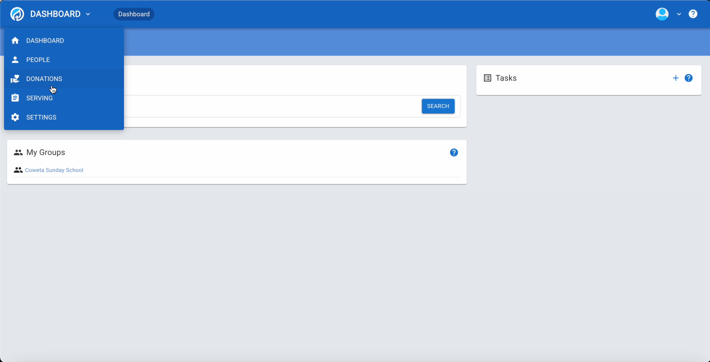
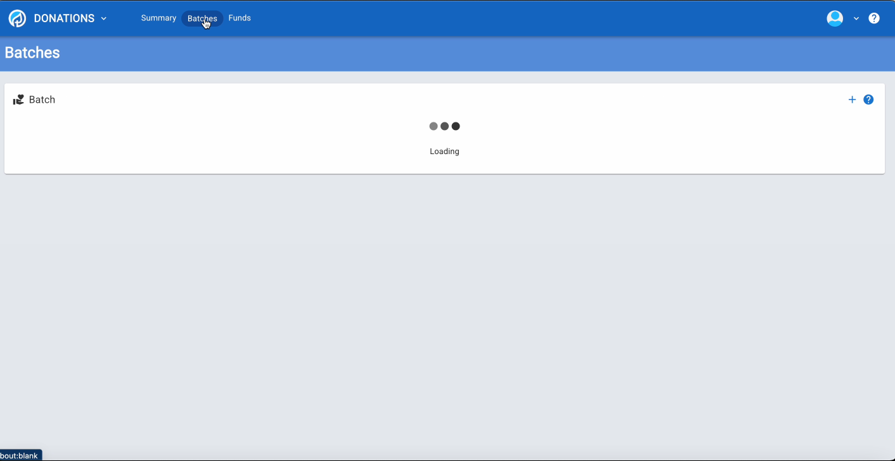
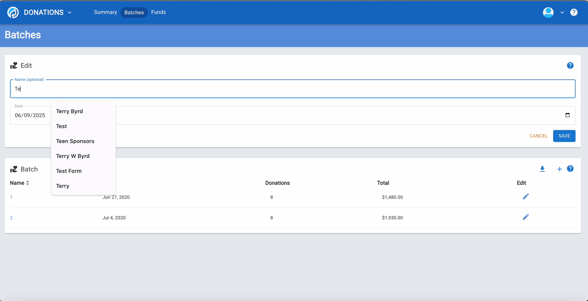
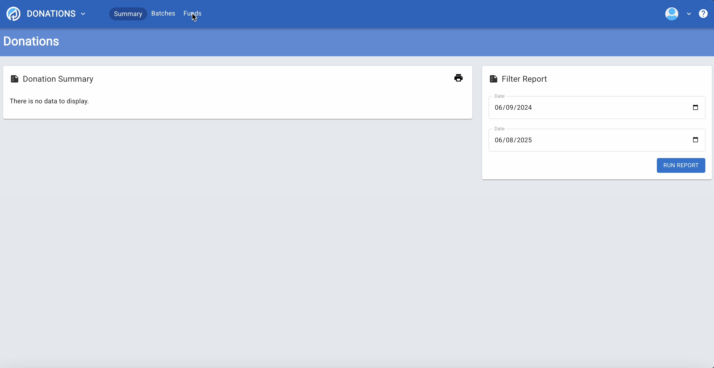
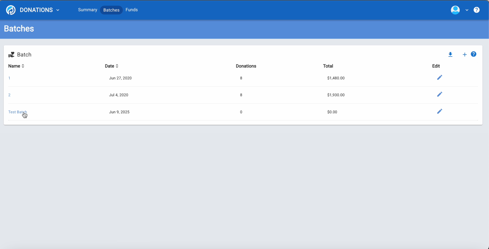
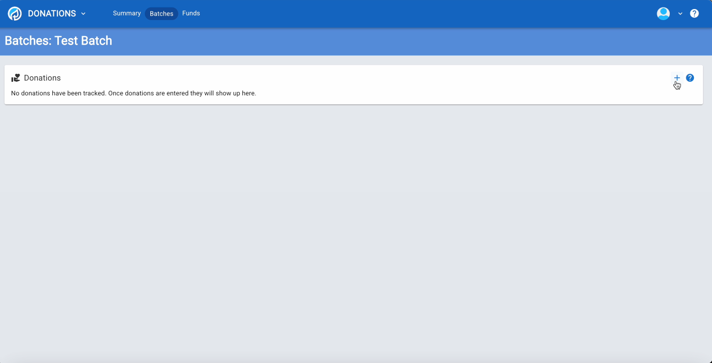
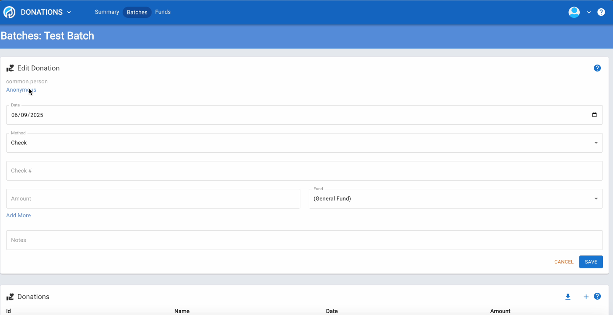
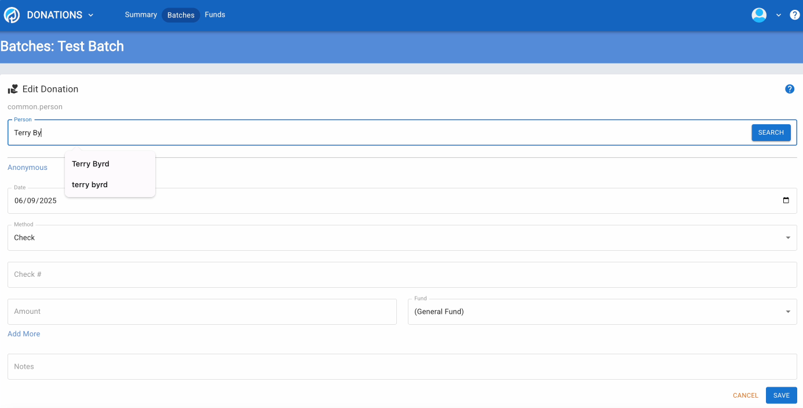
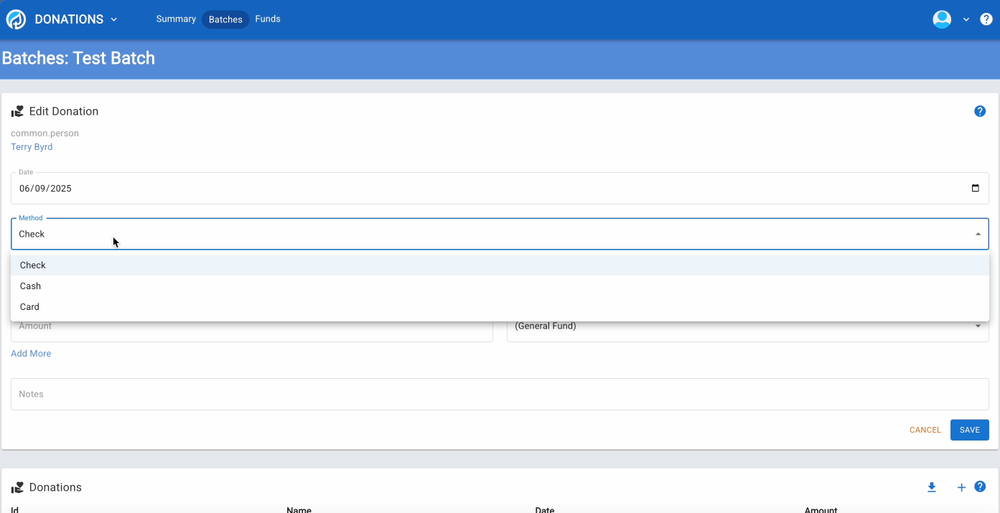

# How to Manually Input Donations in B1.church Admin

  <ul id="playlist">
      <li class="active"><a href="/videos/b1Admin/manual-input/output.mp4" data-steps="manual-input-steps">Manually Inputting Donations</a></li>
  </ul>

<h3>Steps</h3>

  
1.Welcome to the Manual Donation Entry tutorial for B1 Admin. This guide will show you how to manually enter donations into a batch.▼

  

  
2.Navigate to the Batches page and click Add Batch to create a new batch for organizing donations.▼

  

  
3.Enter a batch name and select the date, then click Save.▼

  

  
4.Your new batch appears in the list showing zero donations and zero dollars.▼

  

  
5.Click on the batch name to open it and begin entering donations.▼

  

  
6.Type a person's name in the search field to find the donor.▼

  

  
7.After selecting a person, the donation entry form displays with fields for date, payment method, fund, amount, and check number.▼

  

  
8.Fill in the amount and check number, then click Add Donation.▼

  

  
9.The donation is added to the table below and the form resets for the next entry.▼

  

  
10.To split a donation across multiple funds, click the Edit button on the donation row.▼

  

  
11.The edit form opens showing all the donation details that can be modified.▼

  

  
12.You can split a donation across multiple funds by adding amounts to different funds. The total will automatically calculate from the fund amounts.▼

  

  
13.Click Save to update the donation with your multi-fund allocation. You now know how to manually enter donations and split them across multiple funds.▼

  

## Related Tutorials

- <a href="/b1Admin/donation-report.html">Donation Report</a>
- <a href="/b1Admin/reports.html">Reports</a>
