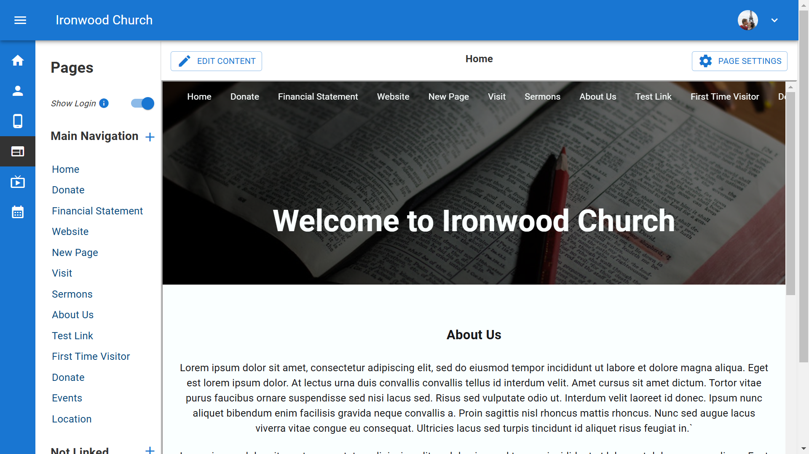
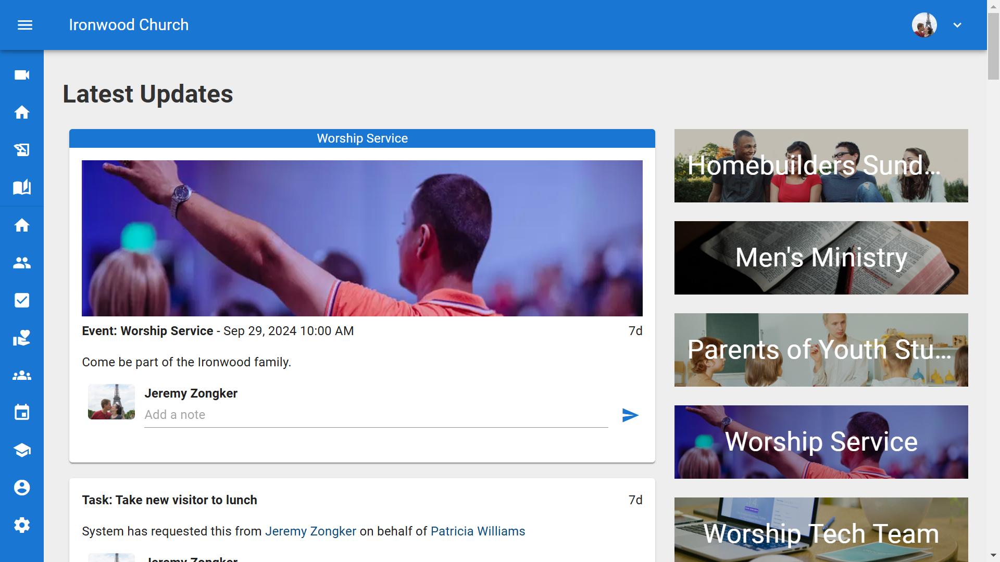

# Mobile Admin

Learn how to configure and customize your church's mobile app experience using B1.church Admin.

For further support, please email [support@churchapps.org](mailto:support@churchapps.org).

  <ul id="playlist">
      <li class="active"><a href="/videos/b1/admin/overview/output.mp4" data-steps="overview-steps">Mobile Admin Overview</a></li>
      <li><a href="/videos/b1/admin/Tabs/output.mp4" data-steps="tabs-steps">Adding Tabs</a></li>
      <li><a href="/videos/b1/admin/members/output.mp4">Member Tabs</a></li>
      <li><a href="/videos/b1/admin/manual/output.mp4">Manual Tabs</a></li>
  </ul>

<h3>Steps</h3>

  
1.B1 is the platform for communicating with members and visitors of your church. It is broken into two main parts.▼

  

  
2.A website builder where you can create your primary church website or supplemental web content.▼

  

  
3.And the member portal that provides various ways for users to interact with your church.▼

  

  
4.This member portal is also available as a mobile app, the B1.church app.▼

  

  
5.As an admin, you can configure which tabs appear in the mobile app from the Mobile App Settings page.▼

  

  
6.Some tabs show up automatically when conditions are met. Others can be manually added by clicking the Add Tab button.▼

  

<h3>Steps</h3>

  
1.This tutorial will help you configure your tabs in the B1 mobile app. From the B1 dashboard, click Settings in the left sidebar.▼

  

  
2.Click on Mobile Apps to access the mobile app settings.▼

  

  
3.Click the Add Tab button in the top right to create a new tab.▼

  

  
4.The Add Tab dialog opens. Enter a name for your tab, such as Website.▼

  

  
5.Click on the icon to choose an icon for your tab.▼

  

  
6.The Select Icon modal opens with various icon options to choose from.▼

  

  
7.Click Select Image to add a custom image to your tab.▼

  

  
8.Choose your image from the gallery, upload a photo, or stock photos.▼

  

  
9.The Tab Type dropdown offers many options including Bible, Live Stream, Donation, and more.▼

  

  
10.Enter the URL you want the tab to link to in the URL field.▼

  

  
11.Choose the Visibility setting to control who can see this tab.▼

  

  
12.Once you've configured all settings, click Save Tab.▼

  

  
13.Your new tab now appears in the App Tabs list.▼

  

## Related Tutorials
- <a href="/b1Admin/website-setup.html">Website Setup</a>
- <a href="/b1Admin/website-elements.html">Page Content - Sections and Elements</a>
