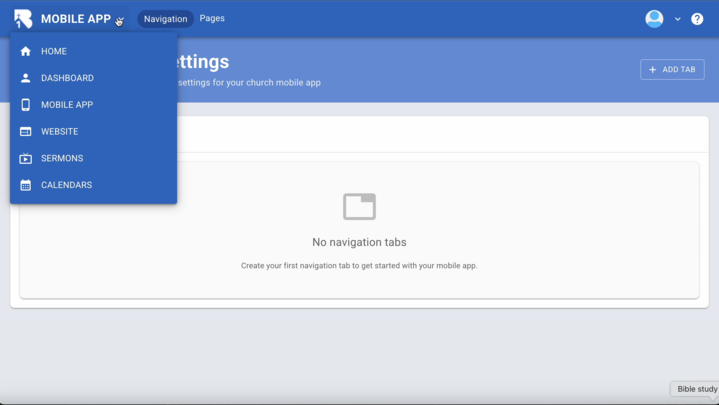

# Introduction to B1 Website Builder

  <ul id="playlist">
      <li class="active"><a href="/videos/b1/website/website-intro/output.mp4" data-steps="website-intro-steps">Website Builder Introduction</a></li>
  </ul>

<h3>Steps</h3>

  
1.Every B1 account comes with a website. To access your website builder, click Website in the left menu.▼

  

  
2.This opens Website Pages where you can manage pages and content. Click Add Page at the top right.▼

  

  
3.Choose blank as the page type and name it Home.▼

  

  
4.Click Edit to start building your page.▼

  

  
5.Click Page Settings to configure the title and URL.▼

  

  
6.Click the edit pencil.▼

  

  
7.Edit your page title and URL path here.▼

  

  
8.For the home page, enter a forward slash with no text. Other pages use forward slash and page title. Click Save.▼

  

  
9.Click Edit Content to begin adding content.▼

  

  
10.Click Add Content to open the elements panel.▼

  

  
11.Every page must begin with a Section. Choose Section to add a container.▼

  

  
12.Drag a Section onto your page.▼

  

  
13.Click the section and switch to the CUSTOM tab.▼

  

  
14.The CUSTOM tab controls colors for backgrounds, headings, text, and links.▼

  

  
15.Click the Background Type dropdown.▼

  

  
16.Choose Image to upload a background image.▼

  

  
17.Or choose YouTube Video to add a video background.▼

  

  
18.Select Color and choose a background color.▼

  

  
19.Add an optional section ID for advanced styling.▼

  

  
20.Click Save.▼

  

  
21.Your section displays with the custom background.▼

  

  
22.Click MOBILE to preview mobile layout.▼

  

  
23.Click Add Content again.▼

  

  
24.Choose from text, images, videos, cards, forms, and more.▼

  

  
25.Drag a Text element into your section.▼

  

  
26.Type your text and customize formatting. Click Save.▼

  

  
27.Drag an Image element below your text.▼

  

  
28.Click Select Photo.▼

  

  
29.Upload images or download stock photos. Select an image.▼

  

  
30.Click Save.▼

  

  
31.Your section displays with text and image.▼

  

  
32.Preview your complete website.▼

  

## Related Tutorials

- <a href="/b1Admin/website-setup.html">Website Setup</a>
- <a href="/b1Admin/website-elements.html">Page Content - Sections and Elements</a>
