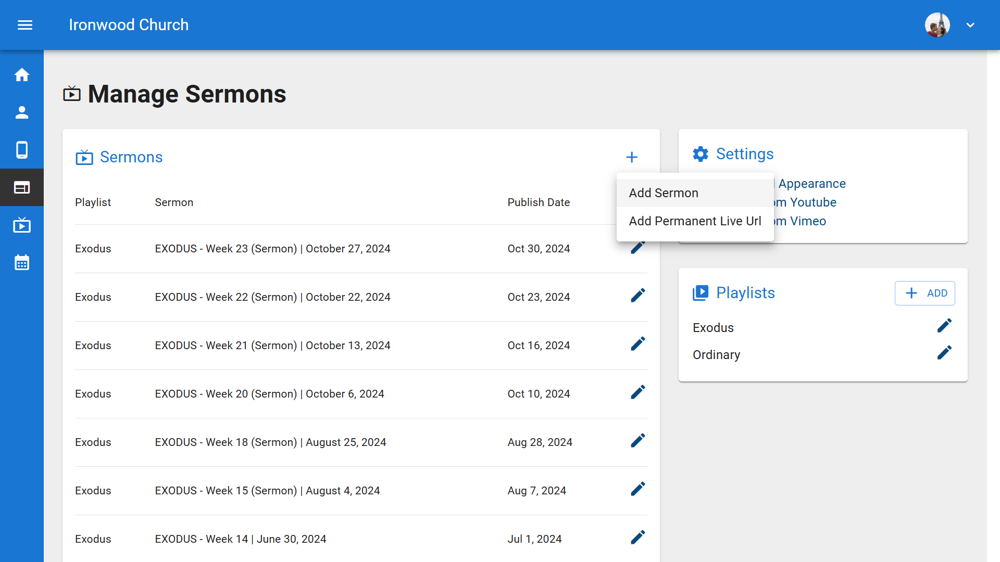
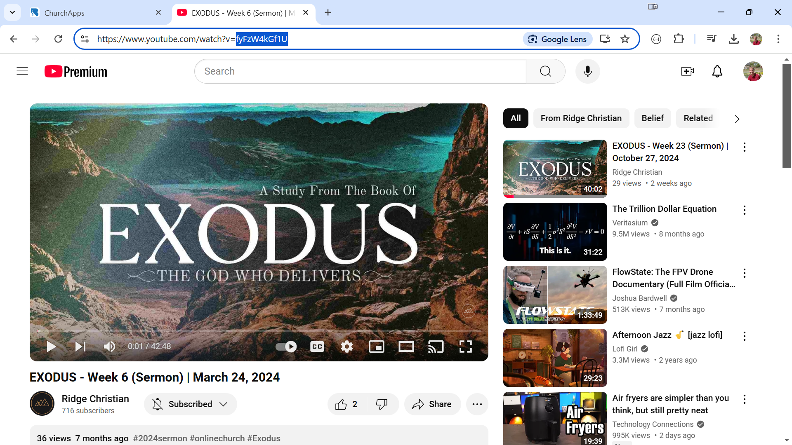
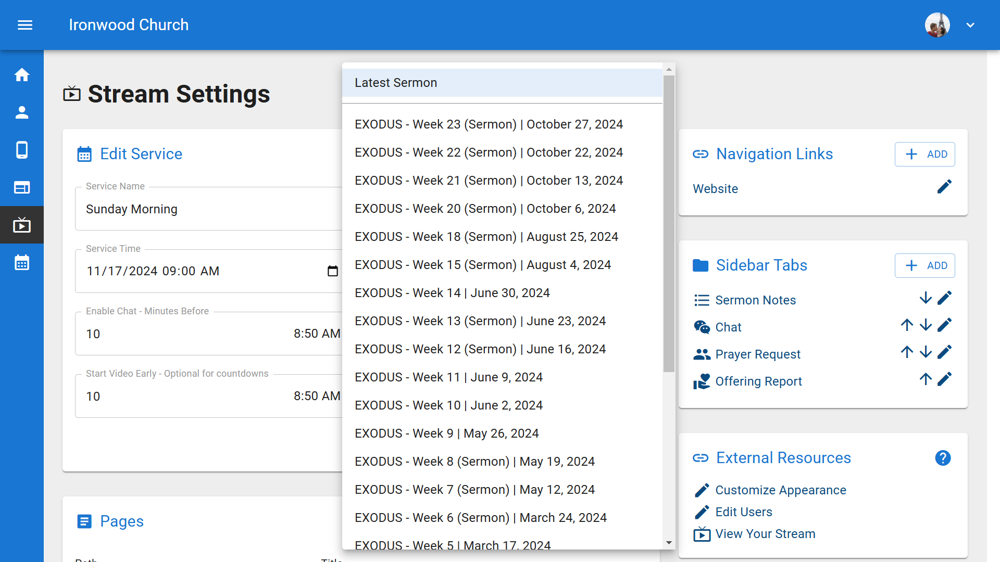
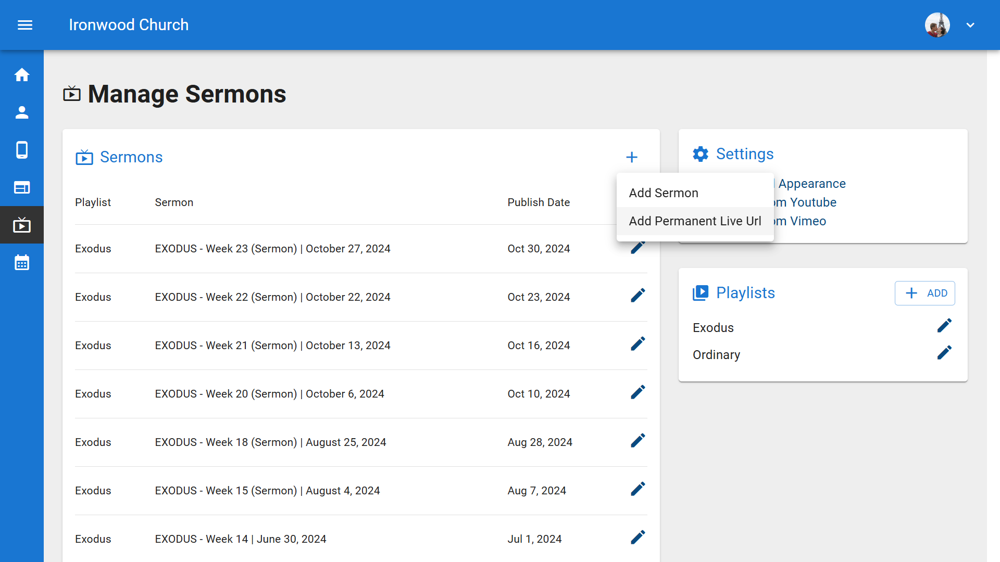
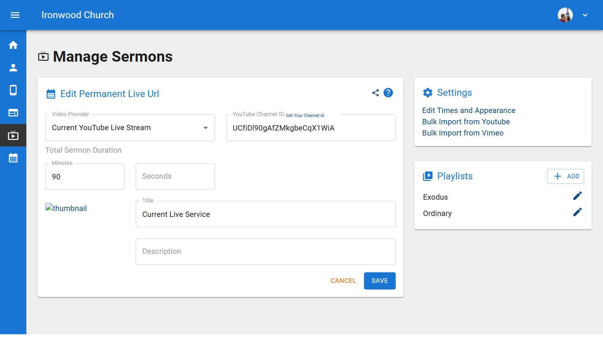

# How to Add a Sermon

  <ul id="playlist">
      <li class="active"><a href="/videos/b1/streaming/sermon/output.mp4" data-steps="sermon-steps">Add a Sermon Video</a></li>
      <li><a href="/videos/b1/streaming/live/output.mp4" data-steps="live-steps">Add a Live Stream URL</a></li>
  </ul>

<h3>Steps</h3>

  
1.From the Dashboard, click on Sermons in the left sidebar to access your sermon library.▼

  

  
2.On the Sermons page, click the Add Sermon button in the top right corner and select Add Sermon from the dropdown.▼

  

  
3.Select a Playlist for your sermon, choose YouTube as the video provider, then enter the YouTube video ID and click Fetch.▼

  

  
4.We recommend YouTube for your video library. However, we also support Vimeo, Facebook, or your own Custom URL.▼

  

  
5.When you click Fetch, all of the video details will be imported automatically. Make any changes you wish and click Save.▼

  

  
6.The sermon will now appear in your sermons list, organized by playlist.▼

  

  
7.To schedule this sermon for a live stream, go to Live Stream Times and select your sermon from the Video Settings dropdown.▼

  

<h3>Steps</h3>
<parameter name="step-accordion">
  
1.To set up a permanent live stream that automatically shows whatever is currently live on your YouTube channel, start from the Dashboard and click on "Sermons" in the left sidebar.▼

  

  
2.From the Sermons page, click the "Add Sermon" button in the top right corner.▼

  

  
3.From the dropdown menu, select "Add Permanent Live URL". This option allows you to create a permanent connection to your YouTube channel's live stream.▼

  

  
4.On the Edit Permanent Live URL page, the Video Provider is set to "Current YouTube Live Stream" by default. You can also choose YouTube, Vimeo, Facebook, or Custom Embed URL if needed.▼

  

  
5.You'll need your YouTube Channel ID to connect your live stream. Enter it in the YouTube Channel ID field.▼

  

  
6.If you don't know your Channel ID, click the help link to see instructions on how to find it in your YouTube account settings.▼

  

  
7.After entering your Channel ID, add a title and description for your live stream. For example, "First Ironwood Church Worship Service" with a description like "Weekly Worship Service for First Ironwood Church". Then click "Save".▼

  

  
8.Now you need to schedule when this live stream will be available. Click on "Live Stream Times" in the top navigation.▼

  

  
9.On the Live Stream Times page, click the "Add Service" button to create a new scheduled service time.▼

  

  
10.In the Add New Service form, enter a Service Name like "Sunday Morning" and set your Service Time. For example, 9:00 AM on Sundays.▼

  

  
11.Set "Recurs Weekly" to "Yes" if this is a regular weekly service, or "No" if it's a one-time event. Most churches will choose "Yes" for their regular Sunday services.▼

  

  
12.Configure your Chat Settings by setting how many minutes before and after the service the chat should be enabled. Under Video Settings, you can set how early to start showing the video for countdown or pre-service content.▼

  

  
13.In the Sermon dropdown under Video Settings, select the permanent live URL you just created, "First Ironwood Church Worship Service". This connects your scheduled service to your live stream.▼

  

  
14.Click "Save" to schedule your service. Your live stream is now configured and will automatically appear at the scheduled time.▼

  

  
15.You'll see your service listed under Services. To customize your streaming page further, click on the "Settings" tab at the top.▼

  

  
16.In Settings, you can configure Content Tabs like Calendar, Chat, and Prayer requests that will appear alongside your stream. Click "View Your Stream" to see how it will look to your viewers.▼

  

  
17.Your live stream page is now ready. Viewers will see your church logo, the next scheduled service time, and can access the tabs you configured. When you go live on YouTube, the stream will automatically appear on this page.▼

  

## Related Tutorials
- <a href="/b1Admin/youtube-channel-id.html">Get Your YouTube Channel ID</a>
- <a href="/b1Admin/website-setup.html">Website Builder</a>
- <a href="https://vimeo.com/760360001">OBS Basics</a>
