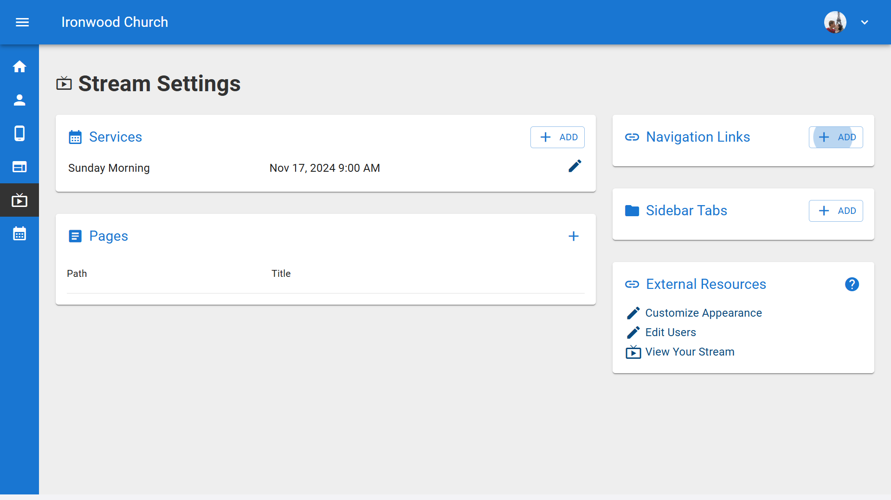
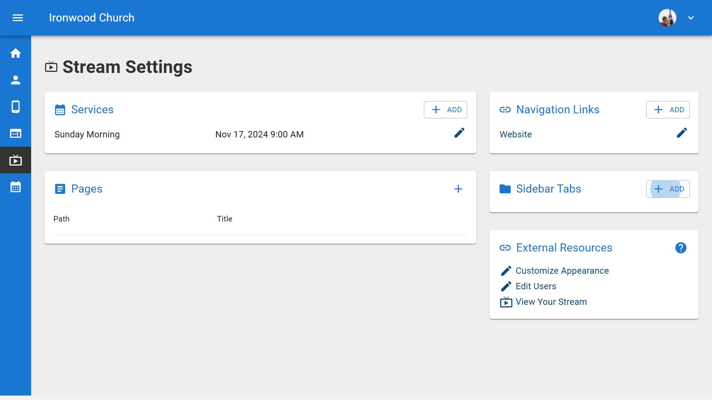
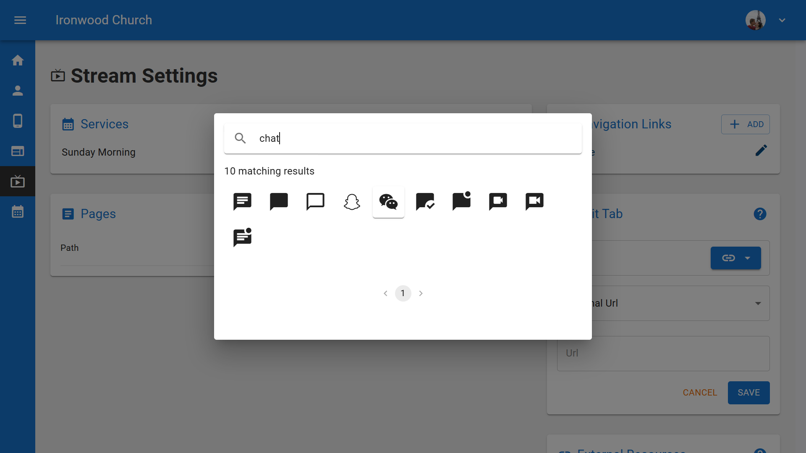
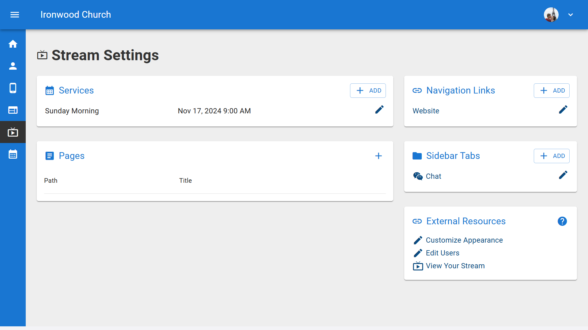

# Configuring Online Streaming and Sermon Videos

  <ul id="playlist">
      <li class="active"><a href="/videos/b1/streaming/services/output.mp4" data-steps="services-steps">Configure Service Times</a></li>
      <li><a href="/videos/b1/streaming/links-tabs/output.mp4" data-steps="links-tabs-steps">Adding Links and Tabs</a></li>
      <li><a href="/videos/b1/streaming/appearance/output.mp4" data-steps="appearance-steps">Set Colors and Logo</a></li>
      <li><a href="/videos/b1/streaming/import/output.mp4" data-steps="import-steps">Import Existing Videos</a></li>
      <li><a href="/videos/b1/streaming/hosts/output.mp4" data-steps="hosts-steps">Adding Hosts</a></li>
      <li><a href="/videos/b1/streaming/sermon/output.mp4" data-steps="sermon-steps">Add a Sermon</a></li>
  </ul>

<h3>Steps</h3>

<h3>Steps</h3>

  
1.To configure navigation links and tabs for your live stream, start from the Dashboard and click on "Sermons" in the left navigation menu.▼

  

  
2.From the Sermons page, click on the "Live Stream Times" tab to access stream configuration.▼

  

  
3.On the Live Stream Times page, click the "Settings" button to configure your streaming page options.▼

  

  
4.In the Settings page, click the add button to add tabs to your livestream.▼

  

  
5.You can add a tab using any external URL or add one of the pre-designed tabs, chat or prayer. If you add a pre-designed tab just give it a name in the tab Text box and the setup is complete.▼

  

  
6.To add a linked tab, give the tab a name and click the icon button to change the icon for the tab.▼

  

  
7.Choose from any of the icons listed or search for more icons.▼

  

  
8.Now enter the URL for the tab you just created. In this case, it is the church calendar for First Ironwood Church.▼

  

  
9.Your streaming settings now show all configured navigation links. These will appear on your live streaming page for viewers to access additional resources and interactive features.▼

  

<h3>Steps</h3>

  
1.To set your color scheme and logo for your live stream page, start from the B1 dashboard and click on Website in the left sidebar.▼

  

  
2.This opens the Website Pages view where you manage all your pages.▼

  

  
3.Click the Appearance tab at the top to access the global appearance settings.▼

  

  
4.The Site Styles page loads, showing a preview of your website with your current colors and logos. On the right side you'll see Style Settings options. Click Color Palette to customize your colors.▼

  

  
5.The Color Palette dialog opens, showing Base Colors at the top for light, accent, and dark shades, and Semantic Colors below. The stream uses the light accent color with dark text for the header, and the dark accent color with light text for the sidebar.▼

  

  
6.Click on any color box to change it. A color picker appears where you can drag the selector to choose your desired color. Your choice updates the preview instantly.▼

  

  
7.You can also use the Suggested Palettes section. Click any palette to instantly apply a pre-designed color scheme. The Color Combinations Preview shows how your selected colors will look together. Be sure to click Save when you're done.▼

  

  
8.To set your logo, click Logo in the Style Settings sidebar. You'll see sections for Main Logos with Light Background Logo and Dark Background Logo, as well as SEO and Browser Assets.▼

  

  
9.For streaming, you'll need to set the Light Background Logo. Click Edit Light Background Logo, then upload your logo file. You'll want to select an image with a transparent background and a 4 to 1 aspect ratio. Use the cropping tool to center your logo and click Update.▼

  

  
10.Your logo will now appear on your live streaming page.▼

  

<h3>Steps</h3>

<h3>Steps</h3>

<h3>Steps</h3>

## Troubleshooting YouTube Automated Livestream

If your automated YouTube livestream is not displaying correctly when using the "Current YouTube Live Stream" option with your Channel ID, try the following:

### Issue: Livestream Shows "Video Unavailable" or Doesn't Load

**Symptoms:**
- The livestream embed shows "Video unavailable"
- The page loads but no video appears
- Direct YouTube embeds work, but the automated channel livestream doesn't

**Solution:**
Check your YouTube channel for old or upcoming scheduled livestreams and delete them:

1. Go to your YouTube Studio
2. Navigate to Content > Live
3. Look for any OLD scheduled lives or upcoming scheduled streams
4. Delete these old/scheduled livestream entries
5. Test your livestream page again

**Why this happens:** YouTube's automated channel livestream embed (`/embed/live_stream?channel=YOUR_CHANNEL_ID`) can be blocked when there are multiple scheduled or past livestream entries in your channel. Removing these allows YouTube to properly identify and serve your current live stream.

**Additional Requirements:**
- Ensure your livestream is set to **Public** (not Unlisted or Private)
- Verify that embedding is allowed in your YouTube stream settings
- Make sure you're using "Current YouTube Live Stream" provider (with Channel ID), not "YouTube" provider (with Video ID)

## Related Tutorials
- <a href="/b1Admin/youtube-channel-id.html">Get Your YouTube Channel ID</a>
- <a href="/b1Admin/website-setup.html">Website Builder</a>
