# Setting up Tasks in B1.church Admin

  <ul id="playlist">
      <li class="active"><a href="/videos/b1Admin/tasks/output.mp4" data-steps="tasks-steps">Setting up Tasks</a></li>
  </ul>

<h3>Steps</h3>

  
1.To set up tasks for your leaders, church members, or groups, navigate to the B1.church Admin Dashboard▼

  
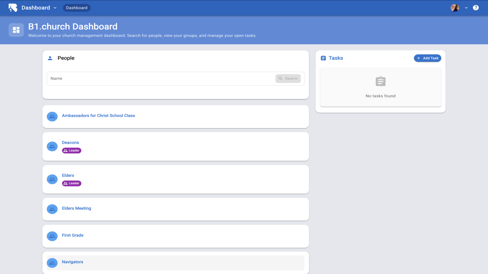

  
2.Then click the Add Task button on the right side of your screen▼

  
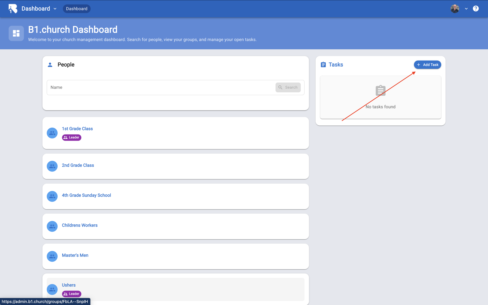

  
3.Here is where you will fill out the information for your task. Since you are the one that is making the task, it is associated with you▼

  
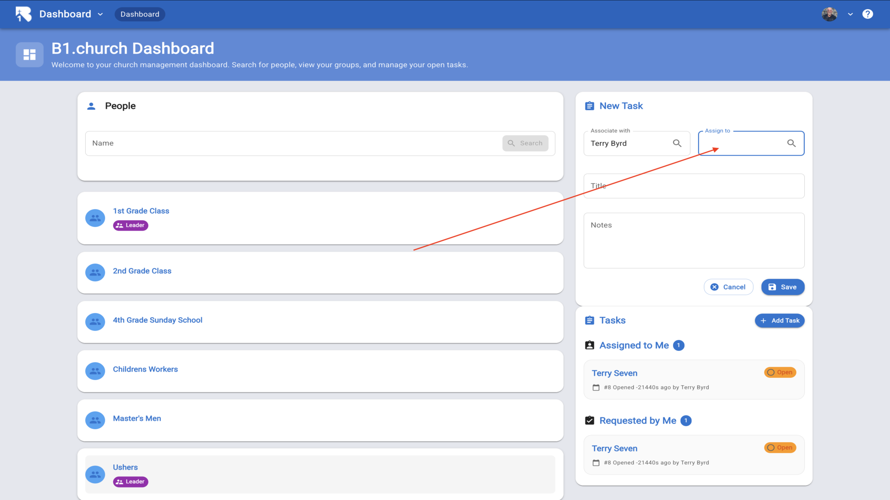

  
4.Click the assign to box and type in the name of a person or click on group and type the name of a group▼

  
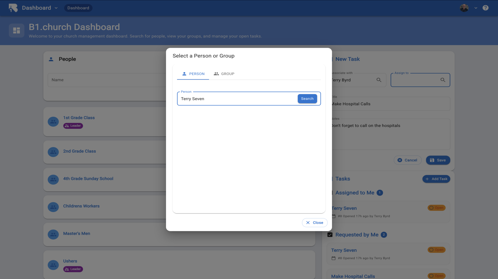

  
5.Hit search▼

  
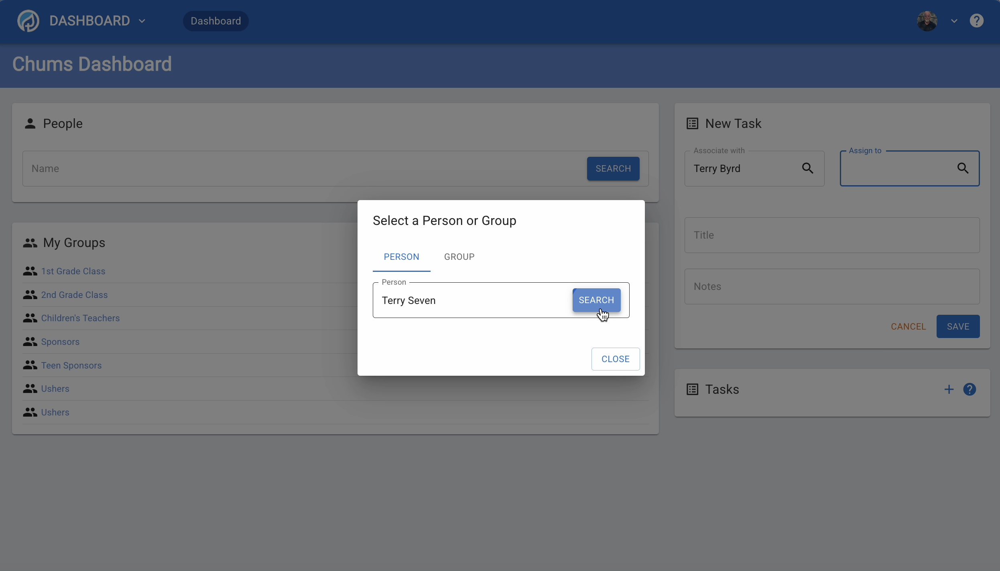

  
6.Select the person or add them if they are not in the database▼

  
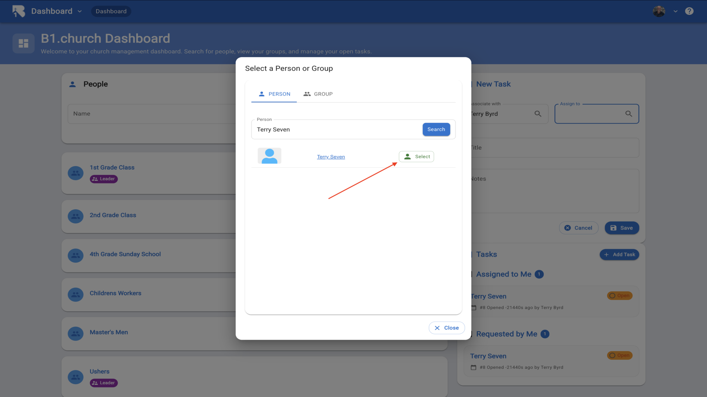

  
7.Now give the task a title▼

  
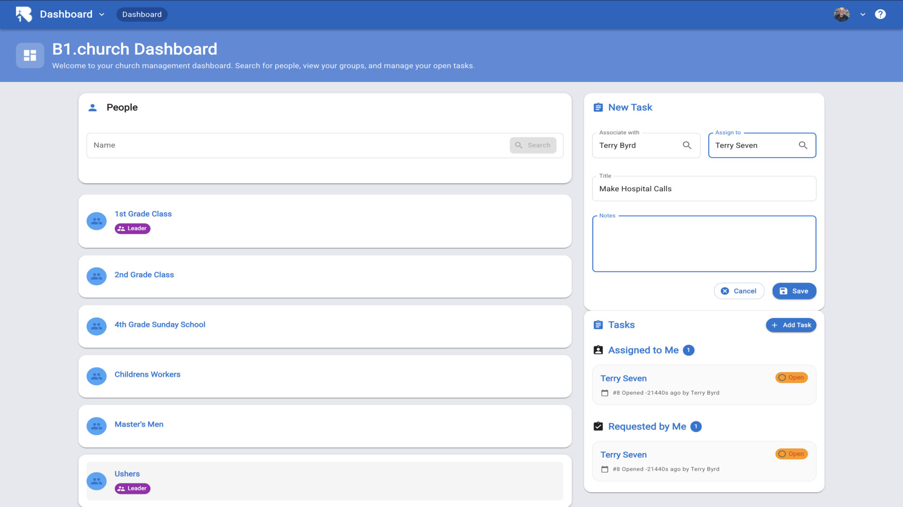

  
8.Type in a note to the person the task is assigned to▼

  
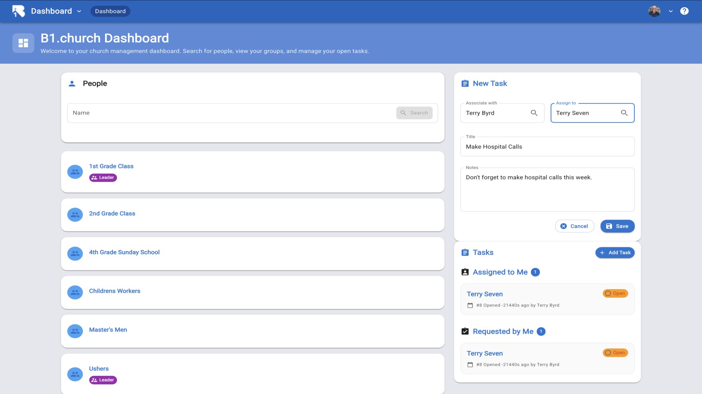

  
9.Click save▼

  
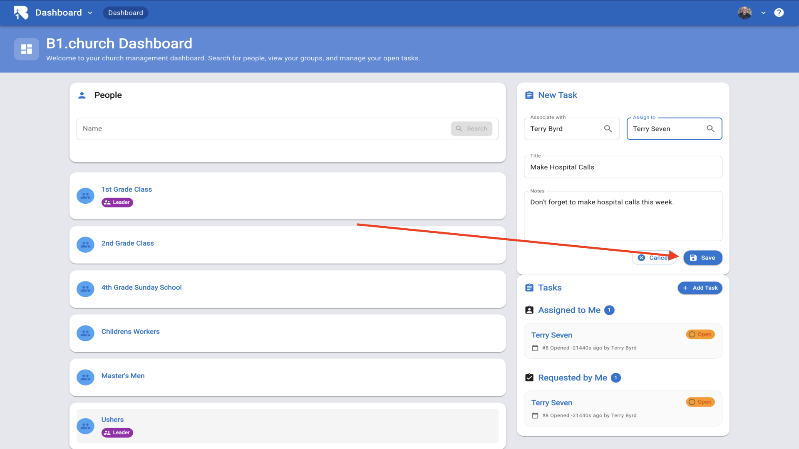

  
10.You can now see the task that you assigned. If you need to edit the task, just click on it and edit▼

  
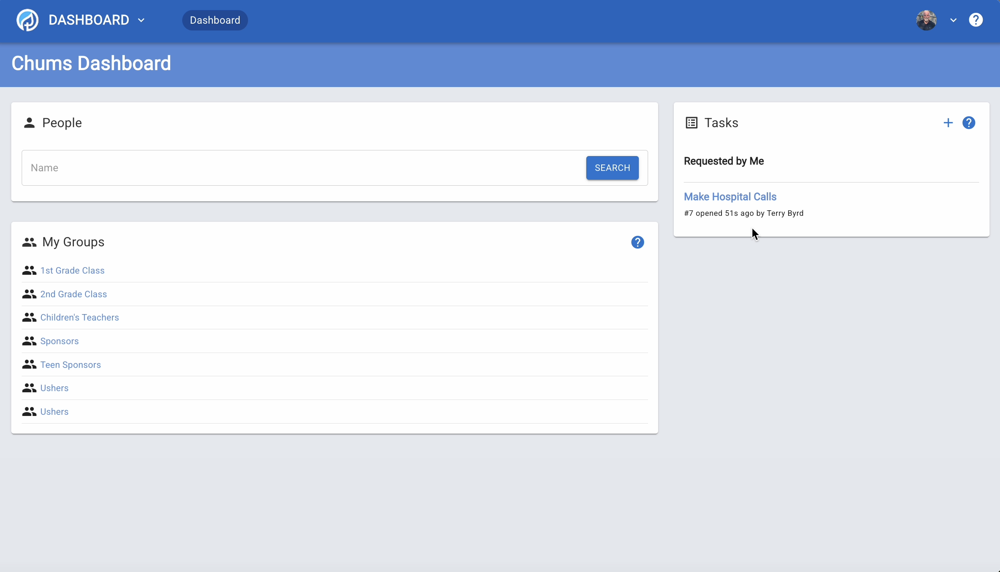

  
11.Now I'll log in as Terry Seven so you can see what the task notification looks like to the person receiving the task▼

  

  
12.I'm now logged in as Terry Seven and navigated to the Tasks page▼

  
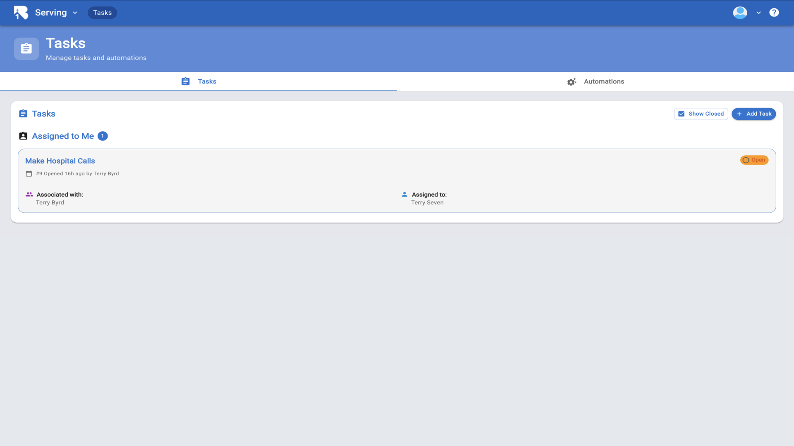

  
13.Here you can see the task assigned to me. You can also see these tasks on the Dashboard and on your mobile app▼

  
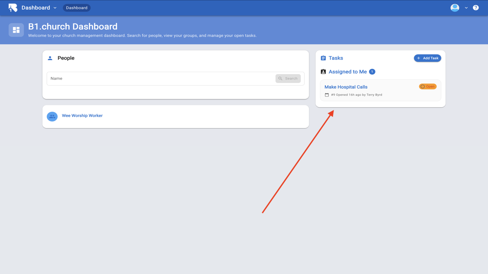

  
14.You can view your assigned tasks from either the Tasks page or from the Dashboard tasks panel▼

  

  
15.Click on the task to open the details. Once the task is completed, you can change the status from open to closed▼

  
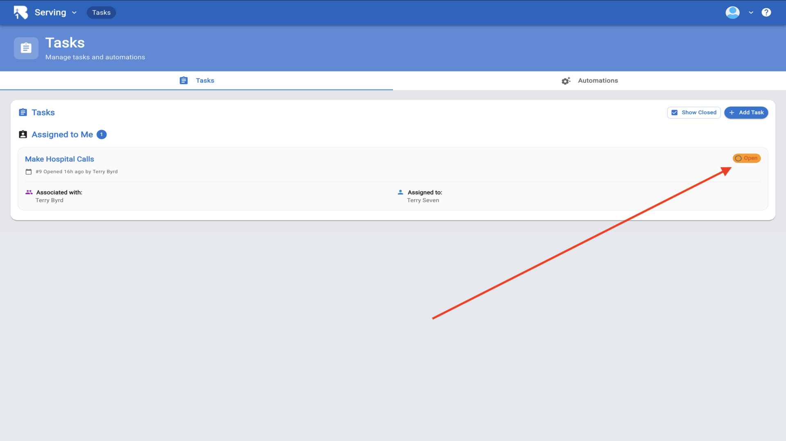

  
16.Click on the status dropdown and choose closed▼

  
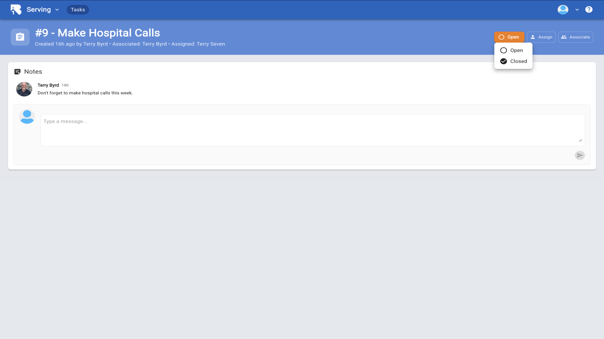

  
17.The task is now marked as completed and closed▼

  
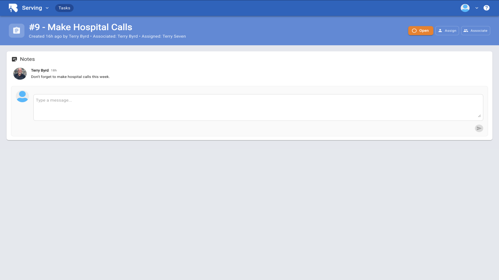

  
18.Closed tasks will no longer appear in your open tasks list unless you enable Show Closed. To automate a task follow the Automation tutorial below▼

  
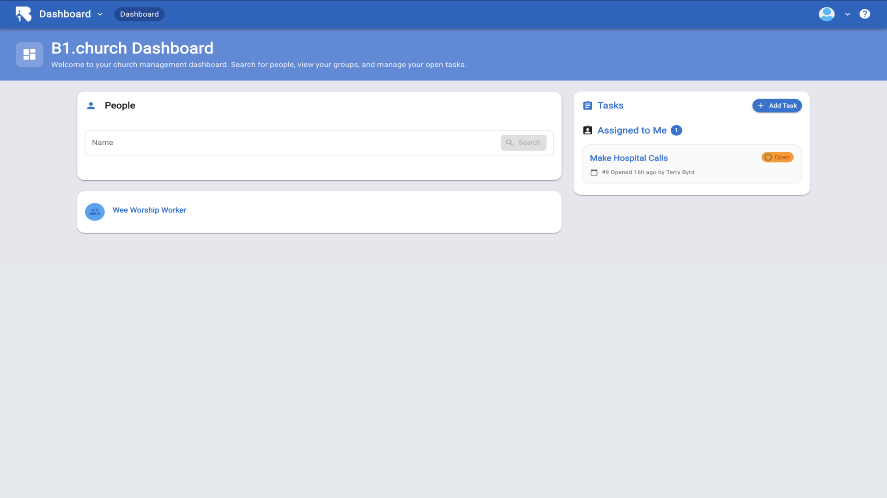

## Related Tutorials

- <a href="/b1Admin/automations.html">Automations</a>
- <a href="/b1Admin/groups.html">Groups</a>
