# Website Initial Setup

Get your B1 website up and running with these foundational tutorials.

  <ul id="playlist">
      <li class="active"><a href="/videos/b1/website/website-intro/output.mp4" data-steps="website-intro-steps">Getting Started</a></li>
      <li><a href="/videos/b1/website/appearance/output.mp4" data-steps="appearance-steps">Global Appearance</a></li>
      <li><a href="/videos/b1/website/domain/output.mp4" data-steps="domain-steps">Domain Configuration</a></li>
  </ul>

<h3>Steps</h3>

  
1.Every B1 account comes with a website. To access your website builder, click Website in the left menu.▼

  
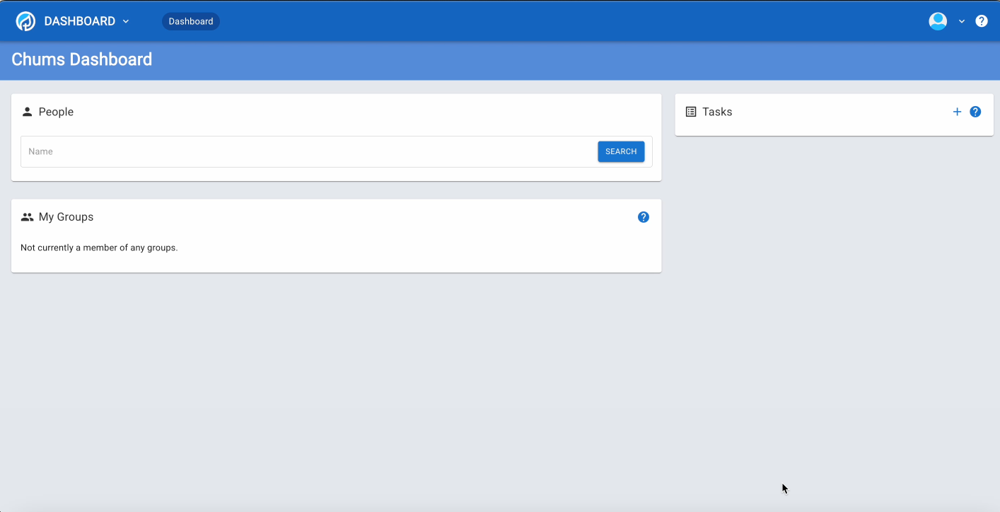

  
2.This opens Website Pages where you can manage pages and content. Click Add Page at the top right.▼

  
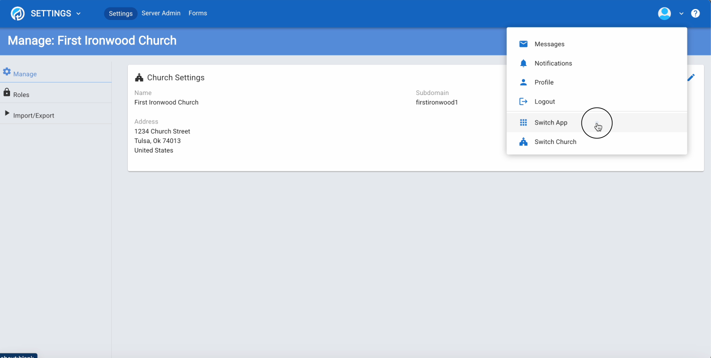

  
3.Choose blank as the page type and name it Home.▼

  

  
4.Click Edit to start building your page.▼

  

  
5.Click Page Settings to configure the title and URL.▼

  
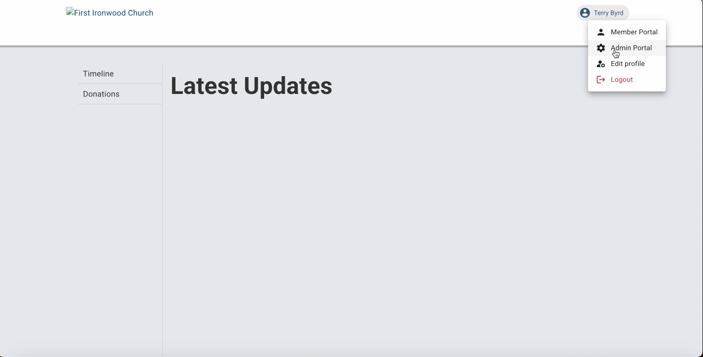

  
6.Click the edit pencil.▼

  

  
7.Edit your page title and URL path here.▼

  
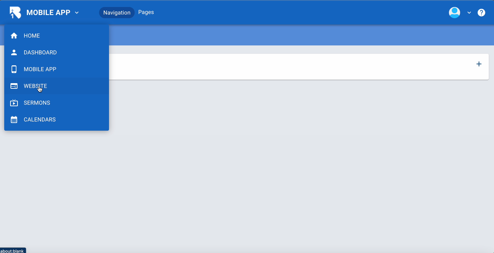

  
8.For the home page, enter a forward slash with no text. Other pages use forward slash and page title. Click Save.▼

  

  
9.Click Edit Content to begin adding content.▼

  

  
10.Click Add Content to open the elements panel.▼

  

  
11.Every page must begin with a Section. Choose Section to add a container.▼

  

  
12.Drag a Section onto your page.▼

  

  
13.Click the section and switch to the CUSTOM tab.▼

  

  
14.The CUSTOM tab controls colors for backgrounds, headings, text, and links.▼

  

  
15.Click the Background Type dropdown.▼

  

  
16.Choose Image to upload a background image.▼

  

  
17.Or choose YouTube Video to add a video background.▼

  

  
18.Select Color and choose a background color.▼

  

  
19.Add an optional section ID for advanced styling.▼

  

  
20.Click Save.▼

  

  
21.Your section displays with the custom background.▼

  

  
22.Click MOBILE to preview mobile layout.▼

  

  
23.Click Add Content again.▼

  

  
24.Choose from text, images, videos, cards, forms, and more.▼

  

  
25.Drag a Text element into your section.▼

  

  
26.Type your text and customize formatting. Click Save.▼

  

  
27.Drag an Image element below your text.▼

  

  
28.Click Select Photo.▼

  

  
29.Upload images or download stock photos. Select an image.▼

  

  
30.Click Save.▼

  

  
31.Your section displays with text and image.▼

  

  
32.Preview your complete website.▼

  

<h3>Steps</h3>

  
1.From the B1 dashboard, click Website in the left sidebar to access website management.▼

  
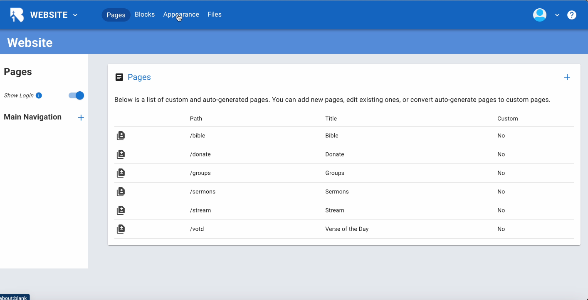

  
2.This opens the Website Pages view where you manage all your pages.▼

  
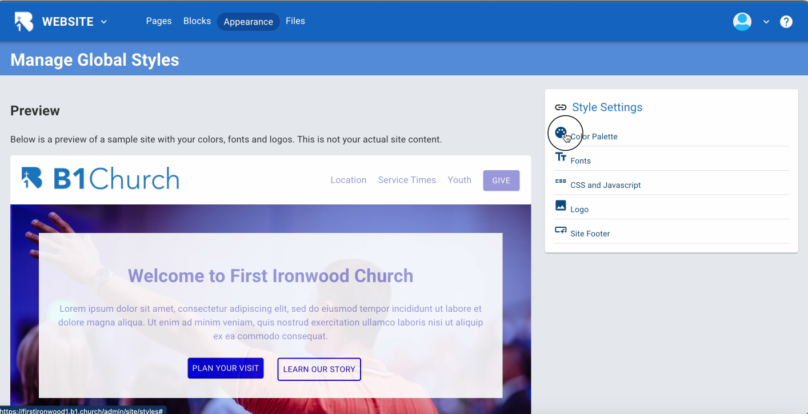

  
3.Click the Appearance tab at the top to access the global appearance settings.▼

  
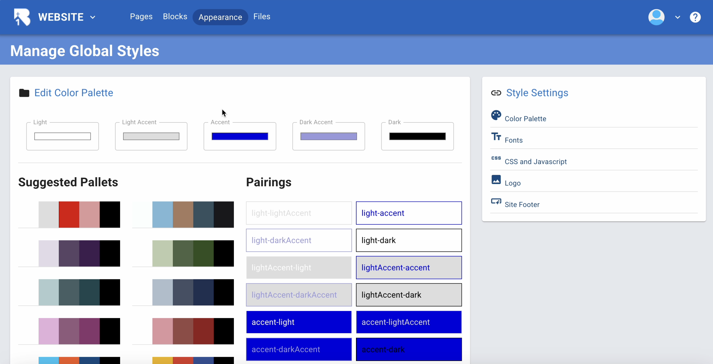

  
4.The Site Styles page loads, showing a preview of your website with your current colors, fonts, and logos.▼

  
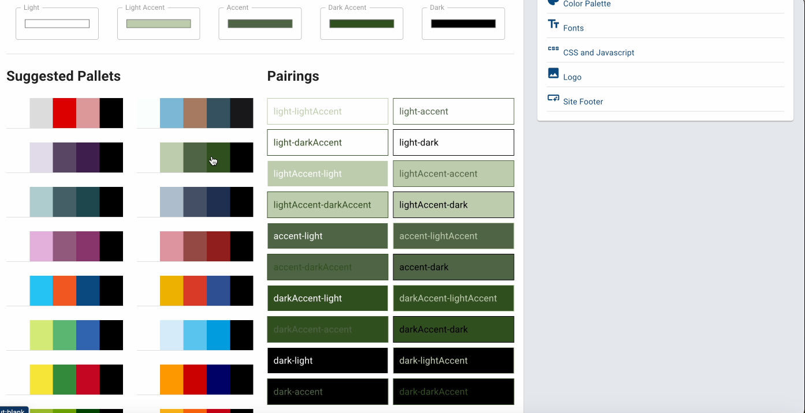

  
5.On the right side you'll see Style Settings options. Click Color Palette to customize your site's colors.▼

  
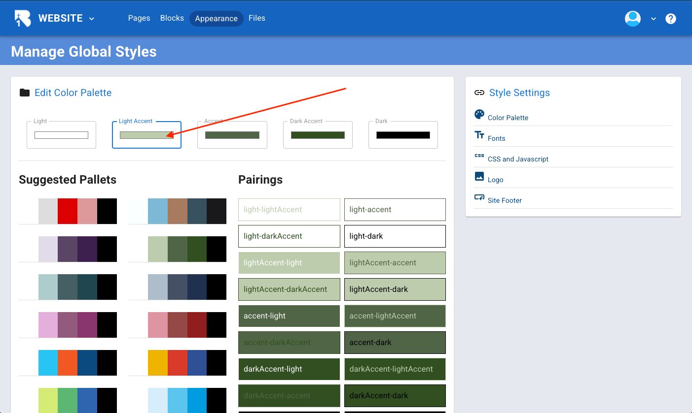

  
6.The Color Palette dialog opens showing Base Colors and Semantic Colors for Primary, Secondary, Success, Warning, and Error.▼

  

  
7.A color picker appears. Drag the selector to choose your desired color or use the color slider below.▼

  
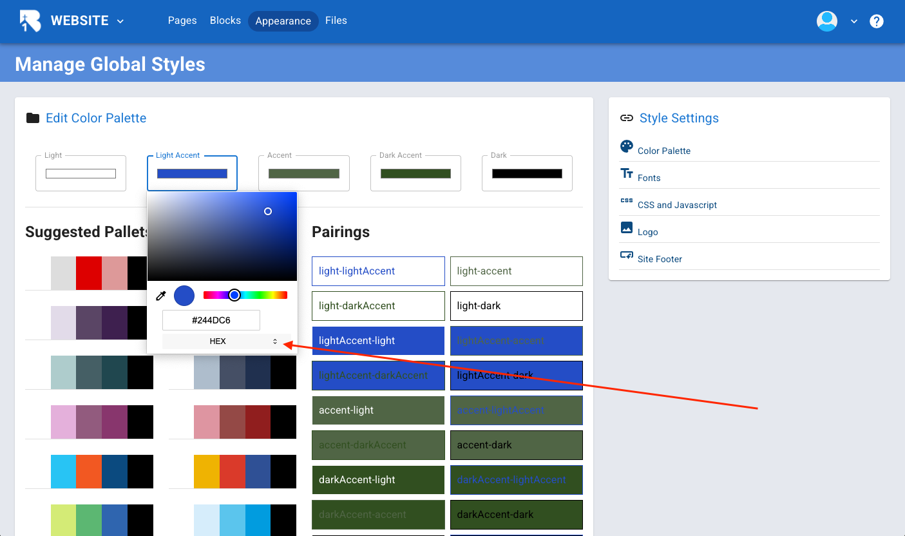

  
8.Customize each semantic color and view Color Combinations Preview. Use Suggested Palettes to apply pre-designed color schemes. Be sure to save.▼

  
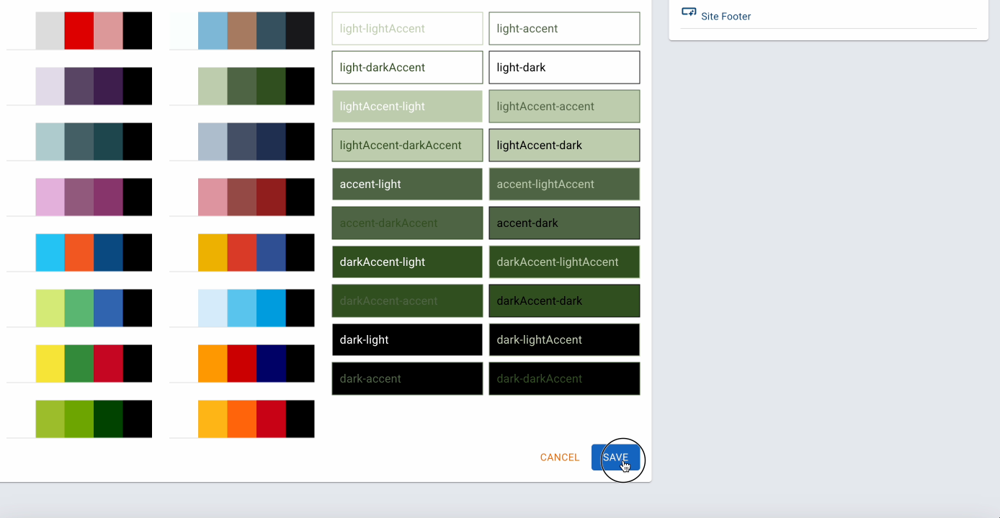

  
9.Next, let's customize fonts.▼

  
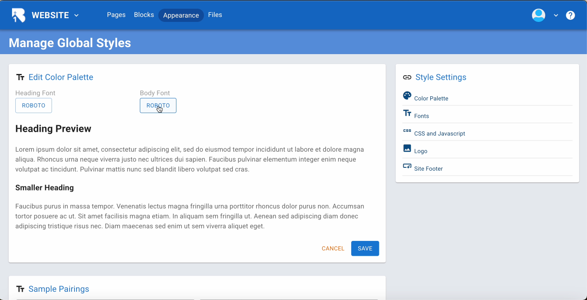

  
10.In the Typography Settings panel, you'll see options for Font Selection and a preview showing how headings will look.▼

  
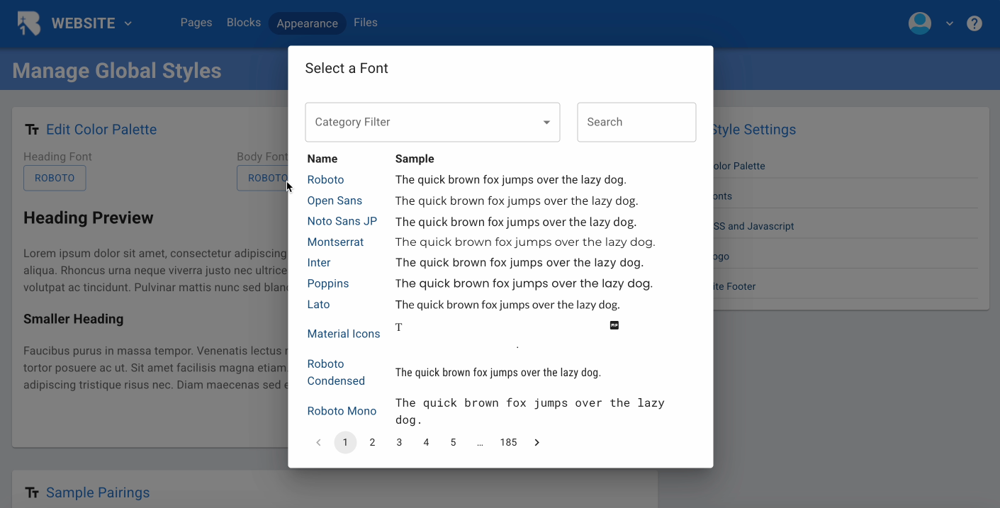

  
11.Click Select a Font to open the font browser. You can search for specific fonts or browse by category.▼

  

  
12.The font list shows categories like Serif, Sans Serif, Display, Handwriting, and Monospace with alphabet previews.▼

  
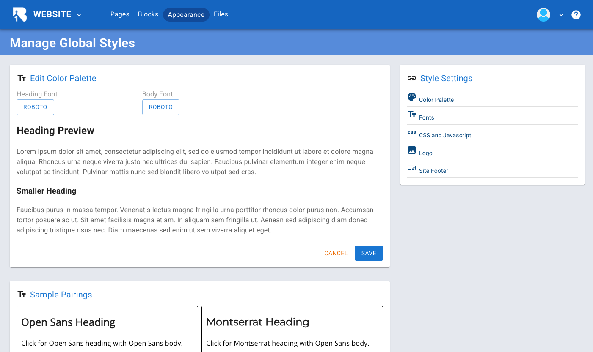

  
13.Be sure to save your font selection.▼

  

  
14.The Typography Scale displays your heading hierarchy with pixel sizes for Heading 1 through Heading 4.▼

  

  
15.Click on Typography Scale to adjust the sizes with input fields for scale multiplier and base size.▼

  
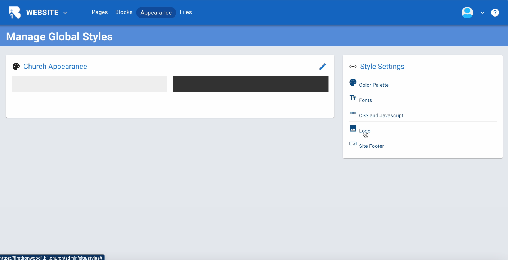

  
16.The preview updates to show how your heading sizes appear. Type directly into input fields to fine-tune. Click save.▼

  
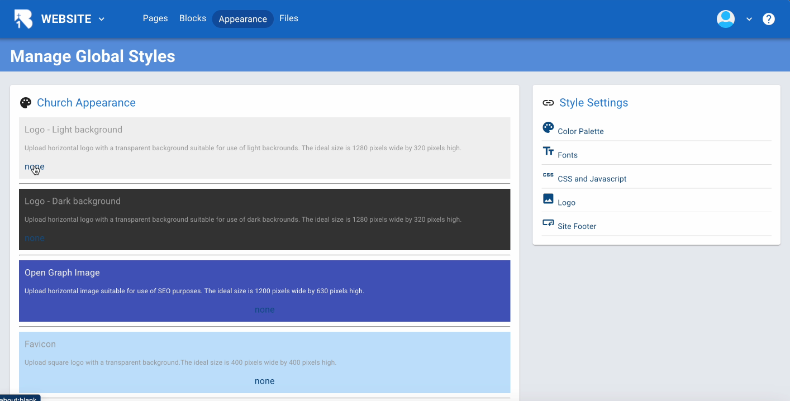

  
17.Click on Spacing Scale in the Style Settings menu.▼

  
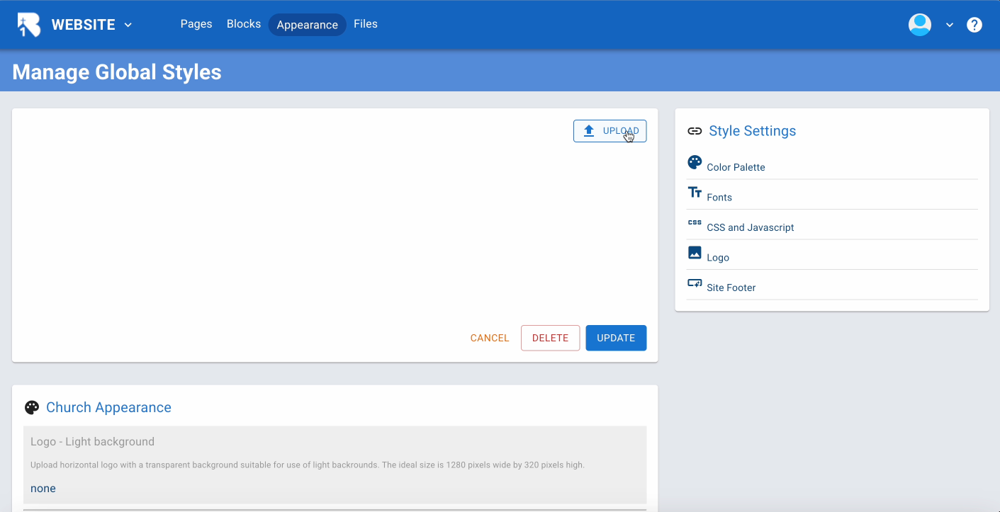

  
18.The Spacing Scale dialog shows spacing values for Extra Small through Extra Large with Practical Examples below.▼

  

  
19.When you're satisfied with your spacing values, click Save Spacing to apply them across your entire site.▼

  

  
20.For advanced users, click CSS and Javascript in the Style Settings.▼

  

  
21.Add Custom CSS to override default styles, Custom HTML for tracking codes, and Common Javascript Examples like Google Analytics.▼

  

  
22.Click Logo in the Style Settings to open Logo and Branding.▼

  

  
23.Upload your Light Background Logo, Dark Background Logo, Social Media Image, and Favicon. Your uploaded logo appears in the site preview.▼

  

  
24.Now let's customize the footer. Click Site Footer in the Style Settings.▼

  

  
25.The Site Footer editor opens showing an empty canvas. Click the plus button in the toolbar to add content.▼

  

  
26.Click on section to add a new section element.▼

  

  
27.Drag the section onto the footer page.▼

  

  
28.Edit the section with a custom color or image or leave as is.▼

  

  
29.Be sure to click save.▼

  

  
30.Now click the plus sign to add other elements.▼

  

  
31.Select rows to create a common footer setup with three columns of text.▼

  

  
32.Drag and drop the rows element to the page and select thirds for the configuration.▼

  

  
33.Be sure to save.▼

  

  
34.Now let's drop some text in each section.▼

  

  
35.Drag and drop a text element to add text.▼

  

  
36.The Edit Element dialog opens with a text editor. Type your church information and use the formatting toolbar to style your text.▼

  

  
37.Click Done to save your footer. Your completed footer now shows with all your church information and will appear on every page of your website.▼

  

<h3>Steps</h3>

  
1.Configuring domains for your site takes place in B1.church Admin. You can go to admin.b1.church and login.▼

  

  
2.Or if you're on B1, click the profile drop down and choose switch app.▼

  

  
3.In B1.church Admin, click on the dashboard on the left.▼

  

  
4.In the dashboard pulldown menu click on settings. If you are missing these options, it's because you lack permissions. Request the person who set up your church grant you access to "Edit Church Settings".▼

  

  
5.Click on manage. Every church that uses B1 has a subdomain assigned to them. In our case, we have chosen "ironwood" as the subdomain for our test church of Ironwood Church. This means we can go to ironwood.b1.church to get to our B1 content.▼

  
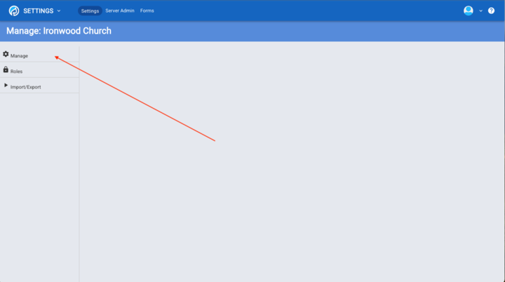

  
6.Set this subdomain to whatever you would like. It needs to have no spaces and be unique.▼

  

  
7.In addition to the subdomain, you can set up your own custom domains to point to your B1 site. For example, the site ChurchApps.org is hosted with B1.▼

  
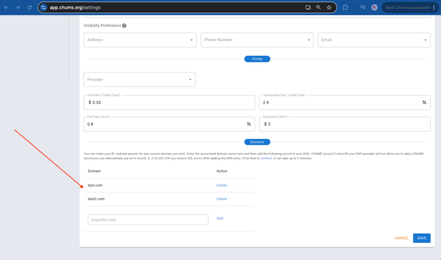

  
8.To configure this, you will need to log into your DNS provider such as GoDaddy, CloudFlare, or in our case A.W.S.▼

  

  
9.There are two records you will need to add. An A record for your root domain of 3.23.251.61.▼

  

  
10.And a CNAME record for your www subdomain pointing to proxy.b1.church.▼

  
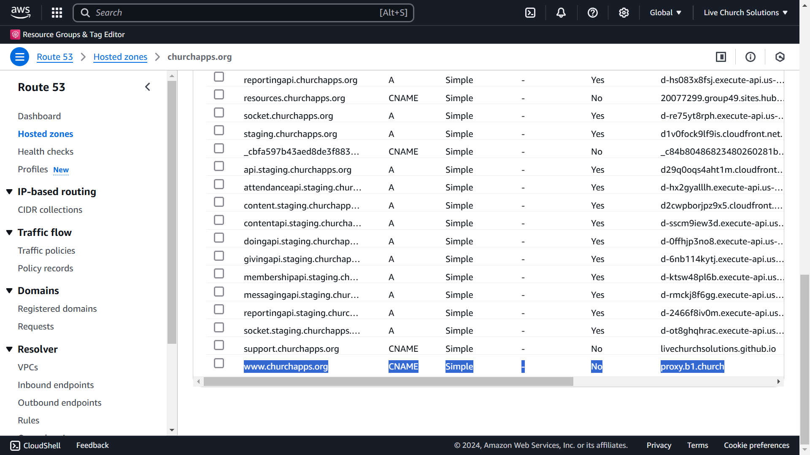

  
11.Once these have been added, return to B1.church Admin and add your domain to the list of custom domains and click Add and Save. After a few minutes your B1 site will be accessible from your custom domain.▼

  

## Related Tutorials

- <a href="/b1Admin/website-page-setup.html">Page Setup</a>
- <a href="/b1Admin/website-advanced.html">Advanced</a>
