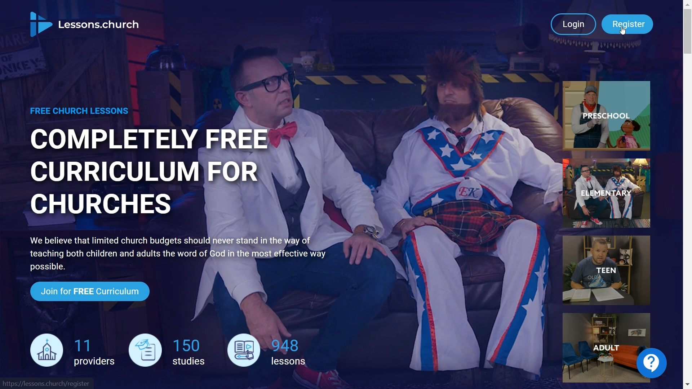
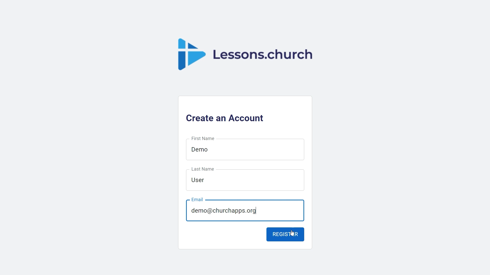
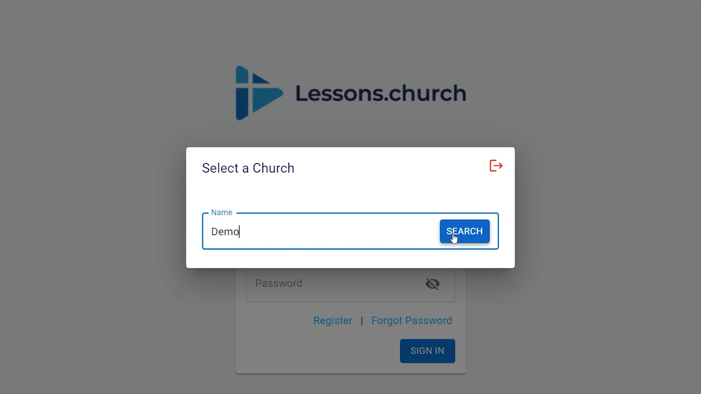
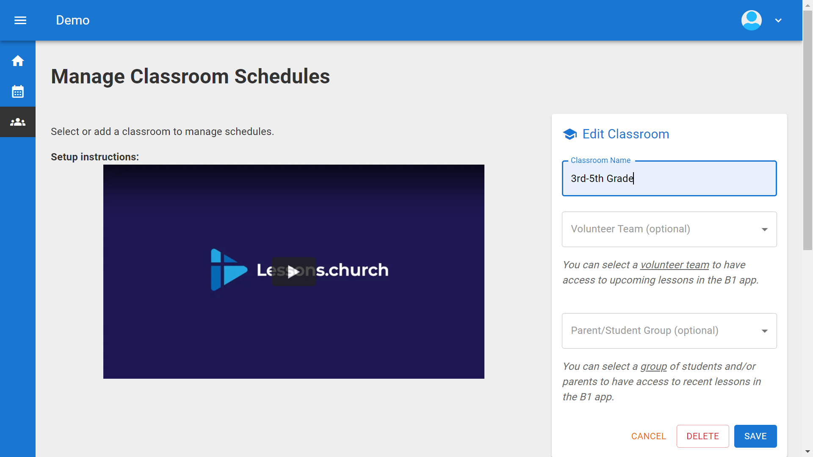
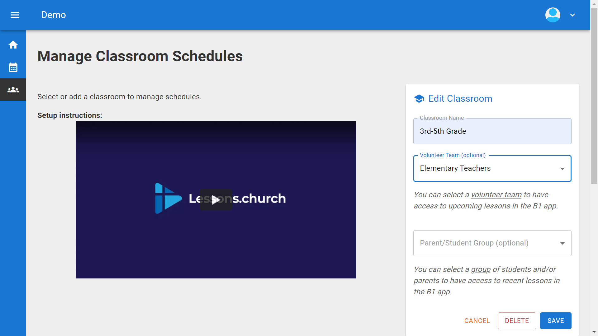
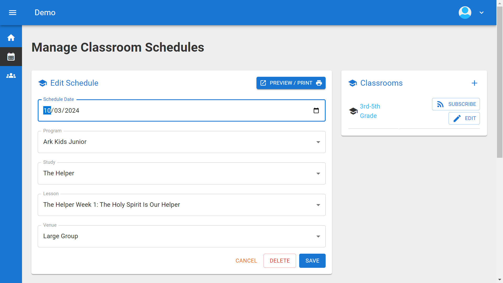
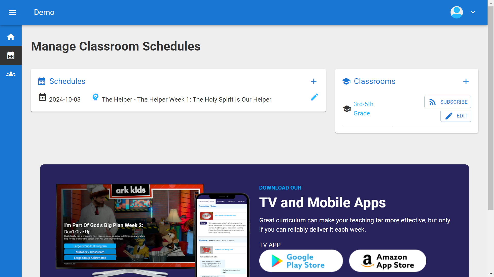
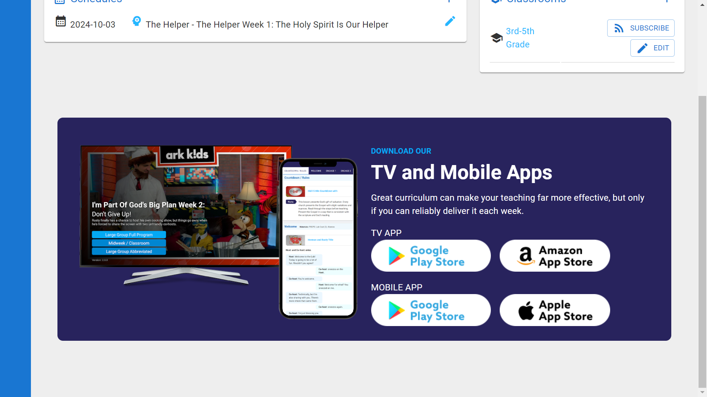

# Setting up Lessons.Church

  

    🚀 Coming Soon
    <h2 style="margin: 0; color: white; font-size: 28px; font-weight: 800;">Lessons.Church Admin is Moving to B1.church!</h2>
  

  

    Get ready for an amazing upgrade! We're bringing Lessons.church directly into B1.church Admin for a seamless experience.
  

  

    <h3 style="color: white; margin-top: 0; font-size: 20px; margin-bottom: 15px;">✨ What's New?</h3>
    <ul style="color: rgba(255,255,255,0.9); font-size: 16px; line-height: 1.8; margin: 0; padding-left: 25px;">
      <li><strong>Schedule lessons right in B1Admin</strong> - No more switching between apps!</li>
      <li><strong>New TV Player Coming</strong> - Better than ever with improved performance</li>
      <li><strong>Seamless Integration</strong> - Everything in one place</li>
    </ul>
  

  

    

      <strong>📅 Start Scheduling Now!</strong> You can begin scheduling your lessons in B1Admin today. The new TV player app will be available soon to present your scheduled lessons.
    

  

  <video controls style="width: 100%; border-radius: 8px; box-shadow: 0 8px 20px rgba(0,0,0,0.3);">
    <source src="../videos/b1Admin/lesson-scheduling/output.mp4" type="video/mp4">
    Your browser does not support the video tag.
  </video>
  

    Watch: How to Schedule Lessons.church Content in B1Admin
  

  <ul id="playlist">
      <li class="active"><a href="../videos/lessons/register/output.mp4" data-steps="register-steps">Register Your Church</a></li>
      <li><a href="../videos/lessons/groups/output.mp4" data-steps="groups-steps">Create Groups</a></li>
      <li><a href="../videos/lessons/create-classroom/output.mp4" data-steps="classroom-steps">Create a Classroom</a></li>
      <li><a href="../videos/lessons/schedule-lesson/output.mp4" data-steps="schedule-steps">Schedule Lessons</a></li>
      <li><a href="../videos/lessons/customize-lessons/output.mp4" data-steps="customize-steps">Customize Lessons</a></li>
      <li><a href="../videos/lessons/connect-mobile/output.mp4" data-steps="mobile-steps">Connect Mobile App</a></li>
      <li><a href="../videos/lessons/connect-tv/output.mp4" data-steps="tv-steps">Connect TV App</a></li>
      <li><a href="../videos/lessons/connect_to_signpresenter/output.mp4" data-steps="signpresenter-steps">Connect to SignPresenter</a></li>
  </ul>

<h3>Steps</h3>

  
1.Click your profile icon in the top right▼

  

  
2.Click Switch App, then select B1.church▼

  

  
3.Click your name in the Member Portal▼

  

  
4.Select Admin Portal▼

  

  
5.This is the B1.church Dashboard▼

  

  
6.Click Dashboard dropdown and select Serving▼

  

  
7.Click Add Ministry▼

  

  
8.Enter a name for your ministry▼

  

  
9.Type Children's Ministry and click Add▼

  

  
10.Click Manage to configure your ministry▼

  

  
11.Click the Teams tab▼

  

  
12.Click Create Team▼

  

  
13.Enter a name like Elementary Teachers and click Add▼

  

  
14.Click Dashboard dropdown and select People▼

  

  
15.Click Groups in the top navigation▼

  

  
16.Click Add Group▼

  

  
17.Click Category Name dropdown and select Add New▼

  

  
18.Enter Parents as category and Parents Of Elementary Kids as group name, click Add▼

  

  
19.Your parent group is now created▼

  

  
20.Click your profile icon and select Switch App▼

  

  
21.Click Lessons.church▼

  

  
22.You're back in Lessons.church - click Add First Classroom to continue▼

  

<h3>Steps</h3>

  
1.Visit lessons.church and click the Register button▼

  

  
2.Enter your first name, last name, and email address, then click Register▼

  

  
3.Check your email for a verification link (check spam if needed)▼

  

  
4.Click the email link and set your password, then click Sign In▼

  

  
5.Click in the search box to select your church▼

  

  
6.Search for your church, or click Register a New Church if not found▼

  

  
7.Click OK on the confirmation dialog▼

  

  
8.Enter your church information and click Save▼

  

  
9.Click on your church to select it▼

  

  
10.You're all set! You can now access the classroom management dashboard▼

  

<h3>Steps</h3>

  
1.Click Add First Classroom▼

  

  
2.Enter a name for your classroom (e.g., Elementary Class)▼

  

  
3.Select the Volunteer Team we created earlier (Elementary Teachers)▼

  

  
4.Select the Parent/Student Group we created (Parents Of Elementary Kids)▼

  

  
5.Click Save to create your classroom▼

  

  
6.Your classroom is created and ready to use▼

  

<h3>Steps</h3>

  
1.Click on your classroom to open it▼

  

  
2.Click Add First Schedule▼

  

  
3.Select Date, Program, Study, Lesson, and Venue, then click Save▼

  

  
4.Your first lesson is scheduled - click Add Schedule for more▼

  

  
5.System auto-selects next week and next lesson in series - just Save▼

  

  
6.Multiple lessons scheduled - continue to build your full schedule▼

  

<h3>Steps</h3>

  
1.Click the small but powerful Customize link next to any scheduled lesson▼

  

  
2.View all sections in the lesson that you can customize▼

  

  
3.Click a section to select it, then click the trash icon to remove▼

  

  
4.Choose This Classroom or All Classrooms - useful when sharing lessons across rooms▼

  

  
5.Removed sections show in red with strikethrough▼

  

  
6.Use the up/down arrows to reorder sections▼

  

  
7.Apply changes to just this classroom or all classrooms as needed▼

  

  
8.Your customized lesson is ready to present▼

  

<h3>Steps</h3>

  
1.Download the B1 Church app from the Apple App Store or Google Play Store▼

  

  
2.Open the app and you'll see the Church Search screen▼

  

  
3.Type your church name in the search field▼

  

  
4.Select your church from the search results▼

  

  
5.On the home screen, tap the menu icon in the top left corner▼

  

  
6.From the side menu, tap the Login button at the bottom▼

  

  
7.The login screen opens where you can sign in with your account▼

  

  
8.Enter your Lessons.church email and password, then tap Sign In▼

  

  
9.After logging in, you'll see your Lessons card - tap it to view lessons▼

  

  
10.Select a scheduled lesson from your classrooms▼

  

  
11.View the lesson with section tabs - tap any tab to jump to that section▼

  

<h3>Steps</h3>

  
1.Present lessons on any Android streaming device (Fire TV, Onn from Walmart, Android 10+)▼

  

  
2.Hold the blue mic button and say "Download Lessons Dot Church App" or search manually▼

  

  
3.Open the app to see the Browse Programs screen with available curriculum▼

  

  
4.Go to Settings using the gear icon, then select Your Church to set it up▼

  

  
5.Type your church name or scan the QR code with your phone for easier setup▼

  

  
6.Select your church from the search results▼

  

  
7.Choose the classroom you want to present lessons for▼

  

  
8.Wait for the lesson to download - this allows offline playback▼

  

  
9.Once downloaded, select Start Lesson to begin presenting▼

  

  
10.Your lesson is now playing on the big screen▼

  

  
11.Press the up arrow to see all videos - select any to jump directly to it▼

  

  
12.Use your remote to play, pause, and navigate through the lesson▼

  

<h3>Steps</h3>

  
1.In Lessons.church, click the RSS icon next to your classroom (use correct venue)▼

  

  
2.Right-click "this url" and select Copy Link Address▼

  

  
3.In SignPresenter, go to Playlists tab and select Horizontal▼

  

  
4.Choose External Feed, or subscribe to bigBigWorship and other feeds for later use▼

  

  
5.Name your playlist and paste the feed URL, then click Save▼

  

  
6.Select a pre-built feed, or click Create a New Custom Playlist▼

  

  
7.Name your custom playlist (e.g., Preschool) - add slides and playlists to it▼

  

  
8.Click the Playlists tab in Available Content to see your saved playlists▼

  

  
9.Click on a playlist like Ark Kids Feed to add it to your custom playlist▼

  

  
10.Add bigBigWorship content for countdowns, worship songs, and games (updated weekly)▼

  

  
11.Click the gear icon to set start/end points for each feed▼

  

  
12.Break your playlist into sections (slides 1-3, countdown, slides 3-9, worship, etc.)▼

  

  
13.Go to Screens tab - add to Schedule (recommended, auto-advance) or Manual Playlist▼

  

  
14.Upload your own videos or images in My Content > Messages▼

  

