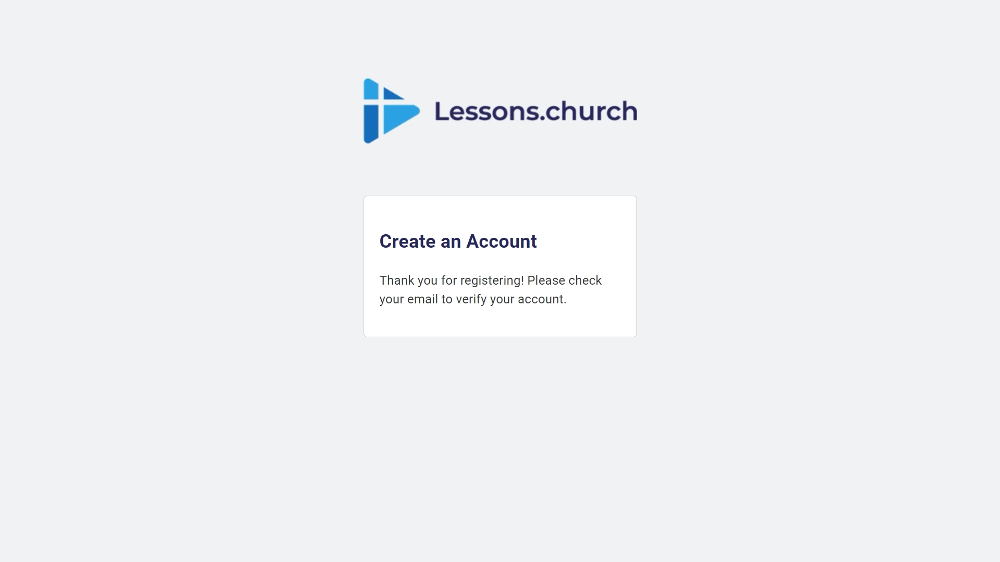
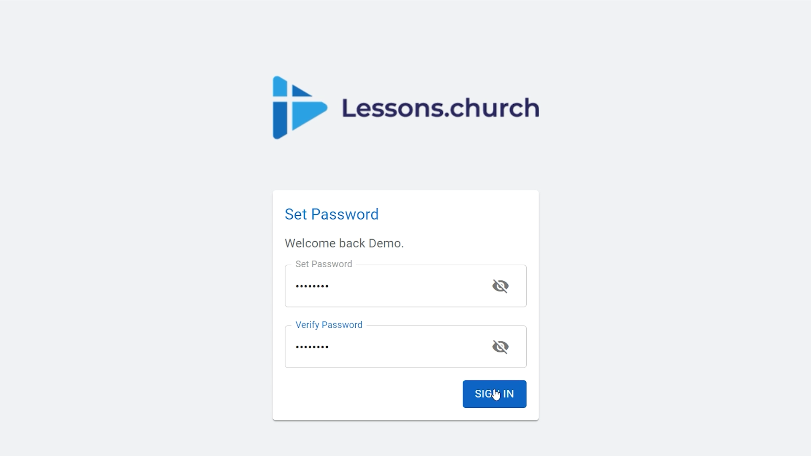
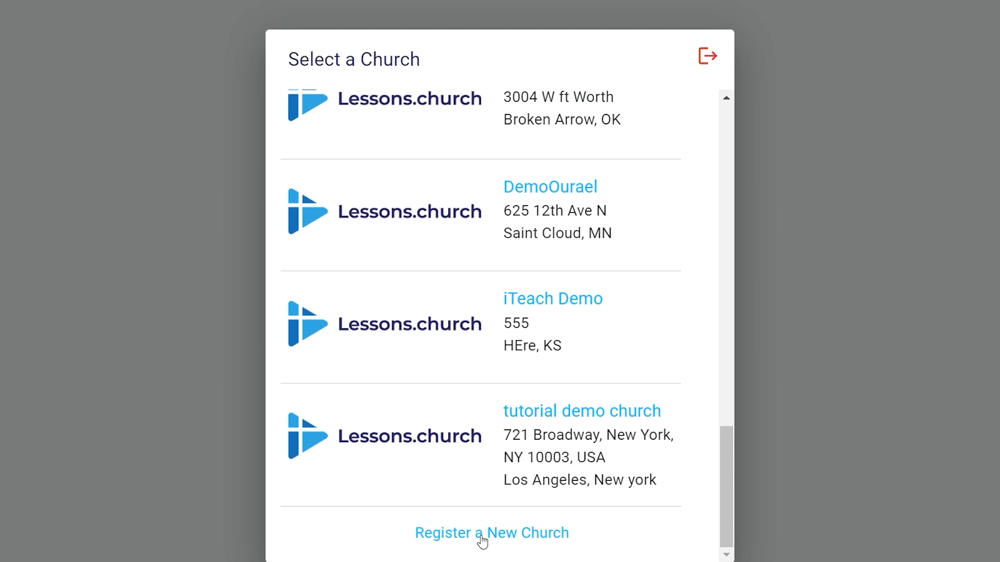
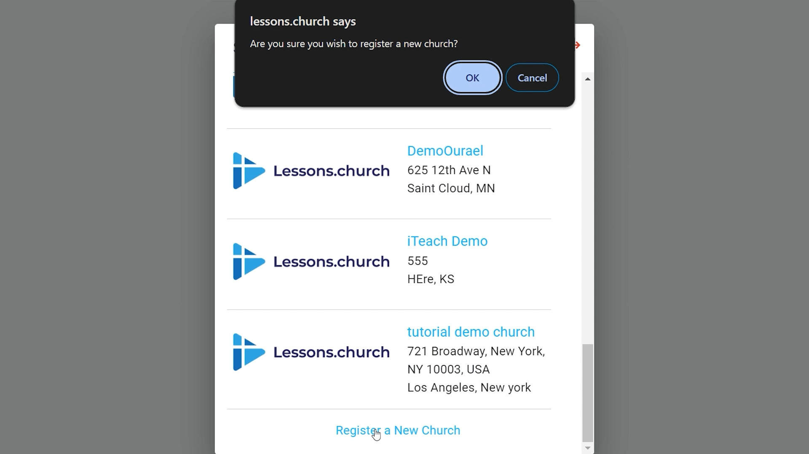
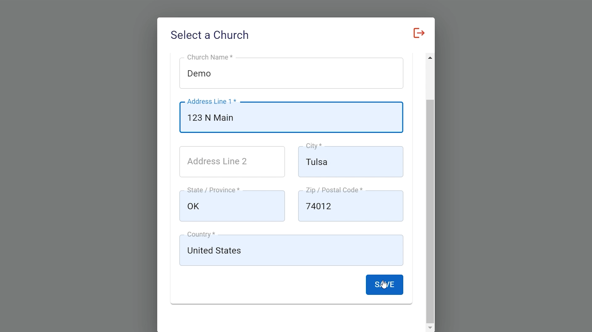
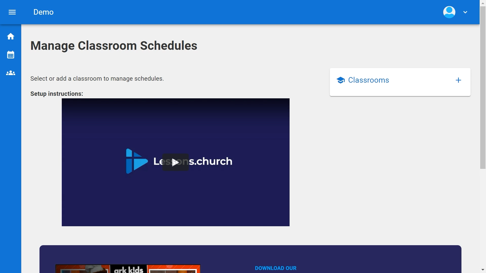

# Setting up Lessons.Church

  <ul id="playlist">
      <li class="active"><a href="../videos/lessons/register/output.mp4" data-steps="register-steps">Register Your Church</a></li>
      <li><a href="../videos/lessons/groups/output.mp4" data-steps="groups-steps">Create Groups</a></li>
      <li><a href="../videos/lessons/create-classroom/output.mp4" data-steps="classroom-steps">Create a Classroom</a></li>
      <li><a href="../videos/lessons/schedule-lesson/output.mp4" data-steps="schedule-steps">Schedule Lessons</a></li>
      <li><a href="../videos/lessons/connect.mp4" data-steps="connect-steps">Connect Apps</a></li>
  </ul>

<h3>Steps</h3>

  
1.Click your profile icon in the top right▼

  

  
2.Click Switch App, then select B1.church▼

  

  
3.Click your name in the Member Portal▼

  

  
4.Select Admin Portal▼

  

  
5.This is the B1.church Dashboard▼

  

  
6.Click Dashboard dropdown and select Serving▼

  

  
7.Click Add Ministry▼

  

  
8.Enter a name for your ministry▼

  

  
9.Type Children's Ministry and click Add▼

  

  
10.Click Manage to configure your ministry▼

  

  
11.Click the Teams tab▼

  

  
12.Click Create Team▼

  

  
13.Enter a name like Elementary Teachers and click Add▼

  

  
14.Click Dashboard dropdown and select People▼

  

  
15.Click Groups in the top navigation▼

  

  
16.Click Add Group▼

  

  
17.Click Category Name dropdown and select Add New▼

  

  
18.Enter Parents as category and Parents Of Elementary Kids as group name, click Add▼

  

  
19.Your parent group is now created▼

  

  
20.Click your profile icon and select Switch App▼

  

  
21.Click Lessons.church▼

  

  
22.You're back in Lessons.church - click Add First Classroom to continue▼

  

<h3>Steps</h3>

  
1.Visit lessons.church and click the Register button▼

  

  
2.Enter your first name, last name, and email address, then click Register▼

  

  
3.Check your email for a verification link (check spam if needed)▼

  

  
4.Click the email link and set your password, then click Sign In▼

  

  
5.Click in the search box to select your church▼

  

  
6.Search for your church, or click Register a New Church if not found▼

  

  
7.Click OK on the confirmation dialog▼

  

  
8.Enter your church information and click Save▼

  

  
9.Click on your church to select it▼

  

  
10.You're all set! You can now access the classroom management dashboard▼

  

<h3>Steps</h3>

<em>Steps coming soon...</em>

<h3>Steps</h3>

<em>Steps coming soon...</em>

<h3>Steps</h3>

<em>Steps coming soon...</em>

